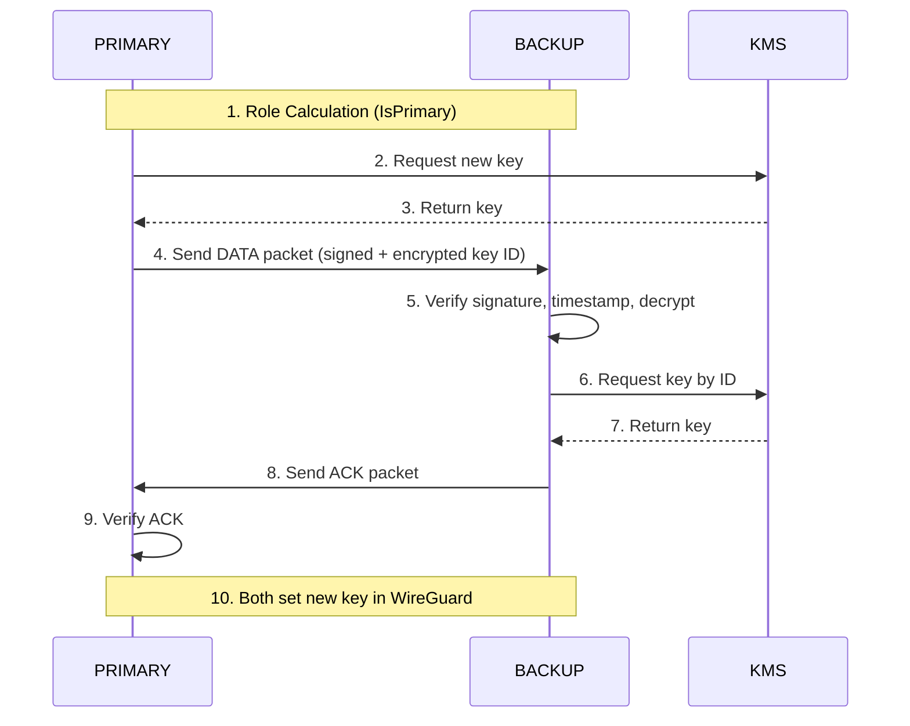

# CODEFLOW.md

## Arnika Key Exchange Protocol – Code Flow

This document describes the step-by-step code flow of the Arnika key exchange protocol, including a flow diagram and references to the relevant code sections.

---

## Flow Diagram

---

## Step-by-Step Code Flow

### 1. **Role Calculation**
- **Where:** `config/config.go` (`IsPrimary()` method)
- **What:** Both nodes deterministically calculate their role (PRIMARY or BACKUP) for the current interval using HMAC-SHA256 and their ArnikaID.
- **Why:** Ensures only one node acts as PRIMARY per interval, preventing race conditions.

### 2. **PRIMARY Requests Key from KMS**
- **Where:** Application logic (not shown in `auth.go`)
- **What:** PRIMARY node requests a new key from the Key Management Server (KMS).
- **Why:** Only PRIMARY initiates key rotation.

### 3. **KMS Returns Key**
- **Where:** Application logic
- **What:** KMS responds with the new key.
- **Why:** PRIMARY needs the key to start the exchange.

### 4. **PRIMARY Sends DATA Packet**
- **Where:** `auth/auth.go` (`PacketData`, `Encrypt`, `Packet.Marshal`)
- **What:** PRIMARY encrypts the key ID with AES-256-GCM, signs the packet with HMAC-SHA256, and sends it to BACKUP.
- **Why:** Single roundtrip — securely transmits key material in one step.

### 5. **BACKUP Verifies DATA, Decrypts Key**
- **Where:** `auth/auth.go` (`UnmarshalPacket`, `Verify`, `Decrypt`)
- **What:** BACKUP checks rate limit, Base64 decodes, verifies HMAC signature, checks timestamp, then decrypts the payload.
- **Why:** Layered security — cheapest checks first, expensive decryption only after authentication passes.

### 6. **BACKUP Requests Key from KMS**
- **Where:** Application logic
- **What:** BACKUP requests the key from KMS using the key ID.
- **Why:** Ensures both nodes have the same key.

### 7. **KMS Returns Key**
- **Where:** Application logic
- **What:** KMS responds with the key.
- **Why:** Synchronizes key material.

### 8. **BACKUP Sends ACK Packet**
- **Where:** `auth/auth.go` (`PacketAck`, `Packet.Marshal`)
- **What:** BACKUP sends an ACK to PRIMARY.
- **Why:** Confirms successful key receipt and setup.

### 9. **PRIMARY Verifies ACK**
- **Where:** `auth/auth.go` (`UnmarshalPacket`, `Verify`)
- **What:** PRIMARY checks the ACK packet.
- **Why:** Ensures BACKUP is synchronized.

### 10. **Both Set New Key in WireGuard**
- **Where:** Application logic
- **What:** Both nodes update their WireGuard PSK.
- **Why:** Secure VPN communication.

---

## Security Mechanisms in Code

- **HMAC-SHA256:** Used for all packet signatures (`Sign`, `Verify`).
- **AES-256-GCM:** Used for encrypting key material (`Encrypt`, `Decrypt`).
- **Rate Limiting:** Per-IP token bucket (30 req/min) checked before any crypto.
- **Timestamp Validation:** ±60s window for replay protection.
- **Zeroization:** All sensitive key material is handled inside `runtime/secret.Do` blocks to minimize memory exposure.

---

## References

- **Packet Structure & Marshalling:**
  See `auth/auth.go` (`Packet`, `Marshal`, `UnmarshalPacket`)
- **Encryption/Decryption:**
  See `auth/auth.go` (`Encrypt`, `Decrypt`)
- **Signature Handling:**
  See `auth/auth.go` (`Sign`, `Verify`)
- **Key Derivation:**
  See `auth/auth.go` (`deriveKey`, `deriveHMACKey`)

---
