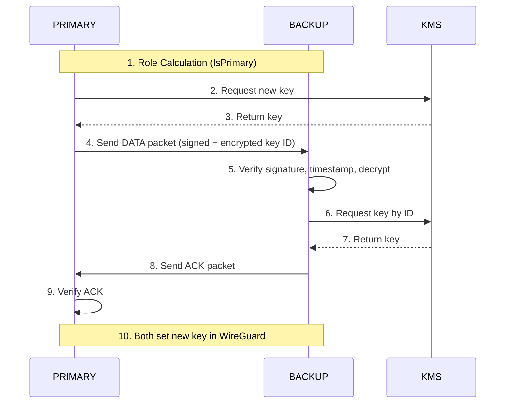
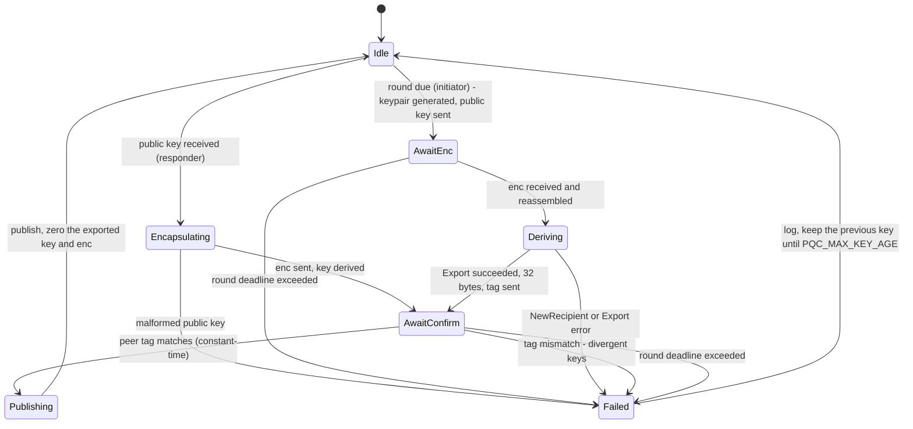

# CODEFLOW.md

## Arnika Key Exchange Protocol – Code Flow

This document describes the step-by-step code flow of the Arnika key exchange protocol, including a flow diagram and references to the relevant code sections.

The exchange runs over **UDP** between `LISTEN_ADDRESS` and the peer's `SERVER_ADDRESS`
(`udpserver.go`). Every packet is signed and encrypted with keys derived from the shared secret
`ARNIKA_PSK`, which therefore must be identical on both peers — see
[`SECURITY.md`](SECURITY.md#inter-peer-channel-authentication-arnika_psk).

---

## Flow Diagram

```mermaid
sequenceDiagram
    participant PRIMARY
    participant BACKUP
    participant KMS

    Note over PRIMARY,BACKUP: 1. Role Calculation (IsPrimary)
    PRIMARY->>KMS: 2. Request new key
    KMS-->>PRIMARY: 3. Return key
    PRIMARY->>BACKUP: 4. Send DATA packet (signed + encrypted key ID)
    BACKUP->>BACKUP: 5. Verify signature, timestamp, decrypt
    BACKUP->>KMS: 6. Request key by ID
    KMS-->>BACKUP: 7. Return key
    BACKUP->>PRIMARY: 8. Send ACK packet
    PRIMARY->>PRIMARY: 9. Verify ACK
    Note over PRIMARY,BACKUP: 10. Both set new key in WireGuard
```

---

## Step-by-Step Code Flow

### 1. **Role Calculation**
- **Where:** `config/config.go` (`IsPrimary()` method)
- **What:** Both nodes deterministically calculate their role (PRIMARY or BACKUP) for the current interval as `HMAC-SHA256(ARNIKA_PSK, intervalNumber)` XOR `ARNIKA_ID`, taking the lowest bit.
- **Why:** Ensures only one node acts as PRIMARY per interval, preventing race conditions.
- **Requires:** the same `ARNIKA_PSK` and the same `INTERVAL` on both peers, and `ARNIKA_ID` values of **different parity** — only the lowest bit of the ID enters the calculation, so two even or two odd IDs give both nodes the same role in every interval.

### 2. **PRIMARY Requests Key from KMS**
- **Where:** `main.go`, via `services.KeyReaderService` (`repositories/kms.go`)
- **What:** PRIMARY node requests a new key from the Key Management Server (KMS).
- **Why:** Only PRIMARY initiates key rotation.

### 3. **KMS Returns Key**
- **Where:** `repositories/kms.go`
- **What:** KMS responds with the new key.
- **Why:** PRIMARY needs the key to start the exchange.

### 4. **PRIMARY Sends DATA Packet**
- **Where:** `auth/auth.go` (`PacketData`, `Encrypt`, `Packet.Marshal`)
- **What:** PRIMARY encrypts the key ID with AES-256-GCM, signs the packet with HMAC-SHA256, and sends it to BACKUP.
- **Why:** Single roundtrip — securely transmits key material in one step.

### 5. **BACKUP Verifies DATA, Decrypts Key**
- **Where:** `auth/auth.go` (`UnmarshalPacket`, `Verify`, `Decrypt`)
- **What:** BACKUP checks rate limit, Base64 decodes, verifies HMAC signature, checks timestamp, then decrypts the payload.
- **Why:** Layered security — cheapest checks first, expensive decryption only after authentication passes.

### 6. **BACKUP Requests Key from KMS**
- **Where:** `main.go` (`GetKeyByID`), `repositories/kms.go`
- **What:** BACKUP requests the key from KMS using the key ID.
- **Why:** Ensures both nodes have the same key.

### 7. **KMS Returns Key**
- **Where:** `repositories/kms.go`
- **What:** KMS responds with the key.
- **Why:** Synchronizes key material.

### 8. **BACKUP Sends ACK Packet**
- **Where:** `auth/auth.go` (`PacketAck`, `Packet.Marshal`)
- **What:** BACKUP sends an ACK to PRIMARY.
- **Why:** Confirms successful key receipt and setup.

### 9. **PRIMARY Verifies ACK**
- **Where:** `auth/auth.go` (`UnmarshalPacket`, `Verify`)
- **What:** PRIMARY checks the ACK packet.
- **Why:** Ensures BACKUP is synchronized.

### 10. **Both Set New Key in WireGuard**
- **Where:** `main.go` (`setPSK`), via `services.KeyWriterService` and the selected key writer adapter (`repositories/wireguard-*.go`)
- **What:** Both nodes update their WireGuard PSK. In hybrid mode the QKD key is first combined with the PQC key via `kdf.DeriveKey` (HKDF-SHA3-256).
- **Why:** Secure VPN communication.

---

## Security Mechanisms in Code

- **HMAC-SHA256:** Used for all packet signatures (`Sign`, `Verify`), keyed by `ARNIKA_PSK` with domain separation (`deriveHMACKey`).
- **AES-256-GCM:** Used for encrypting key material (`Encrypt`, `Decrypt`), keyed by `ARNIKA_PSK` (`deriveKey`).
- **Rate Limiting:** Per-IP token bucket checked before any crypto — `RATE_LIMIT` packets per `RATE_WINDOW`, default 30 per minute.
- **Timestamp Validation:** Replay protection over a ±`MAX_CLOCK_SKEW` window, default ±1m.
- **Zeroization:** All sensitive key material is handled inside `runtime/secret.Do` blocks to minimize memory exposure. This requires `GOEXPERIMENT=runtimesecret` at build time. `secret.Do` erases registers, stack and unreachable heap allocations **only on `linux/amd64` and `linux/arm64`**; on every other platform it just calls its function. `main()` probes this at startup (`secret.Enabled()` from inside a `Do` block, since it reports the nesting depth) and logs a warning when the erasure is inert, so a build for an unsupported `GOARCH` cannot silently look hardened.
- **Process hardening:** `hardenProcess()` (`hardening_linux.go`) runs before the configuration is read, so `ARNIKA_PSK` never exists in an exposed process. It sets `PR_SET_DUMPABLE=0` (no core dump; `/proc/<pid>/{mem,environ,maps}` become root-owned and `ptrace` attach needs `CAP_SYS_PTRACE`), `RLIMIT_CORE=0` (a piped `kernel.core_pattern` ignores the dumpable flag), and `mlockall(MCL_CURRENT|MCL_FUTURE)` to keep key material out of swap. Each step is best effort and failures are logged, not fatal: a container without `CAP_IPC_LOCK` must still rekey its tunnel. `mlockall` needs `CAP_IPC_LOCK` or `LimitMEMLOCK=infinity`, since the limit is charged against locked address space and Go reserves ~1.2 GB of arena; a refused lock is safe because `MCL_FUTURE` only takes effect once `mlockall` succeeds.
- **Secret lifetime:** `ARNIKA_PSK` is held as `[]byte` on `config.Config`, not `string`: Go strings are immutable, so a secret held as one cannot be overwritten and every consumer needing bytes would leave a fresh unclearable heap copy behind on each interval and each PQC round. `main()` drops the variable from the environment with `os.Unsetenv` after parsing and wipes the field via `cfg.ZeroSecrets()` on shutdown. `os.Unsetenv` prevents inheritance by a child process but does **not** scrub `/proc/<pid>/environ`, which reflects the environment as of `execve`; `PR_SET_DUMPABLE=0` is what makes that unreadable.

---

## PQC Key Agreement Round (`pqc-hpke`)

Unless `PQC_ENABLED=false`, a second exchange runs over the same socket as one
additional packet type (`PacketPQC`), producing the PQC half of the PSK. It is
independent of the QKD flow above: `setPSK()` simply consumes whichever key is
current.

```mermaid
stateDiagram-v2
  [*] --> Idle
  Idle --> AwaitEnc: round due (initiator) - keypair generated, public key sent
  Idle --> Encapsulating: public key received (responder)
  Encapsulating --> AwaitConfirm: enc sent, key derived
  Encapsulating --> Failed: malformed public key
  AwaitEnc --> Deriving: enc received and reassembled
  AwaitEnc --> Failed: round deadline exceeded
  Deriving --> AwaitConfirm: Export succeeded, 32 bytes, tag sent
  Deriving --> Failed: NewRecipient or Export error
  AwaitConfirm --> Publishing: peer tag matches (constant-time)
  AwaitConfirm --> Failed: tag mismatch - divergent keys
  AwaitConfirm --> Failed: round deadline exceeded
  Publishing --> Idle: publish, zero the exported key and enc
  Failed --> Idle: log, keep the previous key until PQC_MAX_KEY_AGE
```

Four properties are worth stating explicitly:

- **Nothing is published before confirmation succeeds.** ML-KEM decapsulation
  never fails - a malformed encapsulation returns a pseudorandom key rather than
  an error - so the confirmation exchange is the only thing standing between a
  corrupted message and a silently divergent PSK.
- **The role is pinned at round start** from the round index. It is the same
  `IsPrimary` derivation used for the interval, evaluated once and held: it
  alternates per interval, so re-deriving it mid-round would flip initiator and
  responder in flight.
- **A failed round publishes nothing.** The previous key stays live until
  `PQC_MAX_KEY_AGE`, after which `GetNewKey()` errors and the existing `Mode`
  logic decides. No new fail-closed policy is introduced.
- **The HPKE private key is not zeroed, because it cannot be.** The round zeroes
  the exported 32-byte key and the encapsulation, and `publish` zeroes the key it
  supersedes. The per-round decapsulation key is not zeroable: `hpke.PrivateKey`
  exposes only `KEM()`, `Bytes()` and `PublicKey()`, with no destroy method, so
  it stays in the heap until the GC reclaims it. Recovering it would additionally
  require the round's encapsulation off the wire, and an attacker who can read
  Arnika's heap can read the published key directly, so this widens no realistic
  attack. See [Security Mechanisms in Code](#security-mechanisms-in-code) for the
  process hardening that keeps the heap unreadable in the first place.

See [`docs/pqc-hpke.md`](docs/pqc-hpke.md) for the full module document.

---

## References

- **Packet Structure & Marshalling:**
  See `auth/auth.go` (`Packet`, `Marshal`, `UnmarshalPacket`)
- **Encryption/Decryption:**
  See `auth/auth.go` (`Encrypt`, `Decrypt`)
- **Signature Handling:**
  See `auth/auth.go` (`Sign`, `Verify`)
- **Key Derivation (peer channel):**
  See `auth/auth.go` (`deriveKey`, `deriveHMACKey`)
- **Key Derivation (hybrid QKD+PQC PSK):**
  See `kdf/kdf.go` (`DeriveKey`, HKDF-SHA3-256)
- **Configuration and role election:**
  See `config/config.go` (`Parse`, `IsPrimary`) and [`README.md`](README.md#configuration)
- **Key reader / key writer adapters:**
  See [`KEYCONTROL.md`](KEYCONTROL.md)

---
