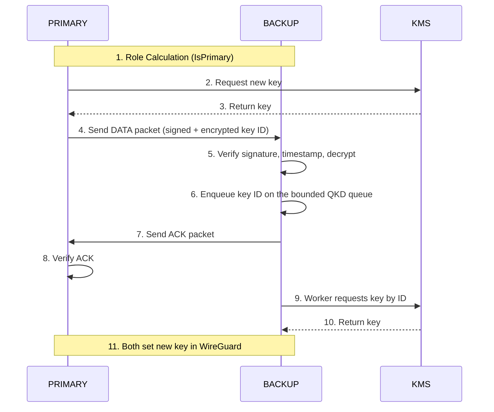
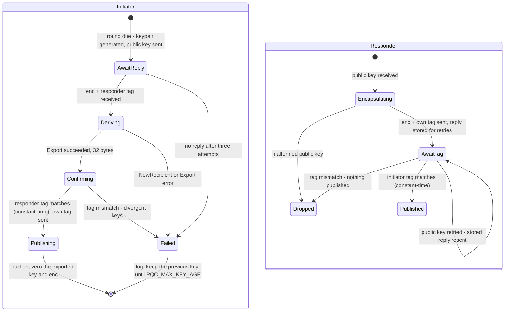

# CODEFLOW.md

## Arnika Key Exchange Protocol – Code Flow

This document describes the step-by-step code flow of the Arnika key exchange protocol, including a flow diagram and references to the relevant code sections.

The exchange runs over **UDP** between `LISTEN_ADDRESS` and the peer's `SERVER_ADDRESS`
(`udpserver.go`). Every packet is signed and encrypted with keys derived from the shared secret
`ARNIKA_PSK`, which therefore must be identical on both peers — see
[`SECURITY.md`](SECURITY.md#inter-peer-channel-authentication-arnika_psk).

---

## Flow Diagram

```mermaid
sequenceDiagram
    participant PRIMARY
    participant BACKUP
    participant KMS

    Note over PRIMARY,BACKUP: 1. Role Calculation (IsPrimary)
    PRIMARY->>KMS: 2. Request new key
    KMS-->>PRIMARY: 3. Return key
    PRIMARY->>BACKUP: 4. Send DATA packet (signed + encrypted key ID)
    BACKUP->>BACKUP: 5. Verify signature, timestamp, decrypt
    BACKUP->>BACKUP: 6. Enqueue key ID on the bounded QKD queue
    BACKUP->>PRIMARY: 7. Send ACK packet
    PRIMARY->>PRIMARY: 8. Verify ACK
    BACKUP->>KMS: 9. Worker requests key by ID
    KMS-->>BACKUP: 10. Return key
    Note over PRIMARY,BACKUP: 11. Both set new key in WireGuard
```

---

## Step-by-Step Code Flow

### 1. **Role Calculation**

- **Where:** `config/config.go` (`IsPrimary()` method)
- **What:** Both nodes deterministically calculate their role (PRIMARY or BACKUP) for the current interval as `HMAC-SHA256(ARNIKA_PSK, intervalNumber)` XOR `ARNIKA_ID`, taking the lowest bit.
- **Why:** Ensures only one node acts as PRIMARY per interval, preventing race conditions.
- **Requires:** the same `ARNIKA_PSK` and the same `INTERVAL` on both peers, and `ARNIKA_ID` values of **different parity** — only the lowest bit of the ID enters the calculation, so two even or two odd IDs give both nodes the same role in every interval.

### 2. **PRIMARY Requests Key from KMS**

- **Where:** `main.go`, via `services.KeyReaderService` (`repositories/kms/kms.go`)
- **What:** PRIMARY node requests a new key from the Key Management Server (KMS).
- **Why:** Only PRIMARY initiates key rotation.

### 3. **KMS Returns Key**

- **Where:** `repositories/kms/kms.go`
- **What:** KMS responds with the new key.
- **Why:** PRIMARY needs the key to start the exchange.

### 4. **PRIMARY Sends DATA Packet**

- **Where:** `auth/auth.go` (`PacketData`, `Encrypt`, `Packet.Marshal`)
- **What:** PRIMARY encrypts the key ID with AES-256-GCM, signs the packet with HMAC-SHA256, and sends it to BACKUP.
- **Why:** Single roundtrip — securely transmits key material in one step.

### 5. **BACKUP Verifies DATA, Decrypts Key**

- **Where:** `auth/auth.go` (`UnmarshalPacket`, `Verify`, `Decrypt`)
- **What:** BACKUP checks rate limit, verifies HMAC signature, checks timestamp, then decrypts the payload.
- **Why:** Layered security — cheapest checks first, expensive decryption only after authentication passes.

### 5a. **A Failing Key Source Reaches `MODE`**

- **Where:** `main.go` (`shouldSetPSKOnQKDFailure`, `setPSK`)
- **What:** Every path on which the QKD key does not arrive is handed to `setPSK` with a nil QKD key so `MODE` decides: invalidate the tunnel where QKD is mandatory, carry on from the PQC key where it is optional. That covers the PRIMARY's KMS request failing, an empty `key_id`, a failing lookup by `key_id`, and a **BACKUP interval that ends without a `key_id` from the peer** - checked once at the end of the interval, which is why the `peerSentKeyID` flag is taken with an atomic `Swap(false)`: reading and consuming in one step is what keeps a single signal from being counted twice.
- **Why:** These paths used to return to the interval ticker instead, which left the whole fallback and fail-closed logic in `setPSK` unreachable and the superseded PSK installed. In a QKD-optional mode the local tick deliberately does *not* set a new PSK: a separate backup timer owns the PSK there, on the instant both peers derive from the wall clock (`nextPQCSetPSKAt`), because setting one on a local tick as well put the two peers on different keys. This relies on both peers' clocks being synchronized closely enough (see "PQC Key Agreement Round" below).

### 6. **BACKUP Enqueues the Key ID**

- **Where:** `udpserver.go` (`qkdQueueDepth`), `main.go` (`result` channel)
- **What:** The read loop hands the decrypted key ID to a bounded queue with a non-blocking send. A full queue leaves the identifier unacknowledged, logs a throttled warning without key material, and lets the sender retry.
- **Why:** The worker below performs the KMS request and the key-writer operation synchronously. A blocking hand-off stalled the read loop for the length of a KMS outage, and with it every PQC frame arriving on the same socket - far longer than `PQC_ROUND_TIMEOUT`. The queue is bounded because unbounded buffering would only accumulate identifiers whose keys are superseded by the time they are served.

### 7. **BACKUP Sends ACK Packet**

- **Where:** `auth/auth.go` (`PacketAck`, `Packet.Marshal`)
- **What:** BACKUP sends an ACK to PRIMARY, **only after** the enqueue in step 6 succeeded.
- **Why:** The ACK is the sender's only signal that it need not retry, so it has to reflect in-process acceptance rather than a successful decryption. Acknowledging first would discard an identifier the peer believes was taken.

### 8. **PRIMARY Verifies ACK**

- **Where:** `auth/auth.go` (`UnmarshalPacket`, `Verify`)
- **What:** PRIMARY checks the ACK packet.
- **Why:** Ensures BACKUP accepted the key ID.

### 9. **Worker Requests Key from KMS**

- **Where:** `udpserver.go` (`runQKDWorker`), `main.go`, `repositories/kms/kms.go`
- **What:** One worker drains the queue and requests the key from KMS using the key ID.
- **Why:** Ensures both nodes have the same key. One worker and not a pool: the channel is FIFO, so a single consumer is what keeps the PSK writes in the order the peer sent the identifiers. It returns on the server's `done` channel, so it cannot outlive the listener.

### 10. **KMS Returns Key**

- **Where:** `repositories/kms/kms.go`
- **What:** KMS responds with the key.
- **Why:** Synchronizes key material.

### 11. **Both Set New Key in WireGuard**

- **Where:** `main.go` (`setPSK`), via `services.KeyWriterService` and the selected key writer adapter ([`repositories/wgnetlink/`](repositories/wgnetlink/), [`repositories/wgmikrotik/`](repositories/wgmikrotik/))
- **What:** Both nodes update their WireGuard PSK. In hybrid mode the QKD key is first combined with the PQC key via `kdf.DeriveKey` (HKDF-SHA3-256). The adapter port is a **single** method, `SetPSK(psk []byte)`. Everything that holds for every writer lives in the service: it serialises the writes, and `InvalidateTunnel` generates the fresh random 32-byte key that tears the session down.
- **Why:** Secure VPN communication. Three details are deliberate. The port takes bytes and not a base64 string, so the PSK never becomes an immutable Go string that could not be cleared afterwards; the one adapter whose transport needs a string encodes at its own boundary, where RouterOS' JSON body makes it unavoidable. `InvalidateTunnel` is in the service and not in each adapter because "a fresh random 32-byte key" is the same rule for all of them, and three copies of it had already drifted onto two different random sources. The write lock is in the service for the same reason: the QKD rotation and the wall-clock fallback timer both reach it from their own goroutines, and an adapter that needs two requests to get there - the RouterOS one resolves the peer, then patches it - could otherwise resolve for one call and write for the other.

---

## Security Mechanisms in Code

- **HMAC-SHA256:** Used for all packet signatures (`Sign`, `Verify`), keyed by `ARNIKA_PSK` with domain separation (`deriveHMACKey`).
- **AES-256-GCM:** Used for encrypting key material (`Encrypt`, `Decrypt`), keyed by `ARNIKA_PSK` (`deriveKey`).
- **Rate Limiting:** Per-IP sliding window checked before any crypto — `RATE_LIMIT` packets per `RATE_WINDOW`. The default is calculated, not static: `ratebudget.go` sizes it from `RATE_WINDOW`, `INTERVAL`, `PQC_ROUND_INTERVAL`, whether PQC is enabled, and the transport's own frame and retry counts, assuming the maximum inbound role allocation for one peer rather than an even split. A static 30 per minute was below what a healthy pair exchanges at `INTERVAL=5s`, where the budget is 137, so the limiter rejected legitimate frames. An explicit `RATE_LIMIT` remains an operator override and a value below the calculated budget starts with a warning naming both numbers; the limiter itself is unchanged, so unauthenticated traffic is still bounded per source IP.
- **Timestamp Validation:** Replay protection over a ±`MAX_CLOCK_SKEW` window, default ±1m.
- **Zeroization:** All sensitive key material is handled inside `runtime/secret.Do` blocks to minimize memory exposure. This requires `GOEXPERIMENT=runtimesecret` at build time. `secret.Do` erases registers, stack and unreachable heap allocations **only on `linux/amd64` and `linux/arm64`**; on every other platform it just calls its function. `main()` probes this at startup (`secret.Enabled()` from inside a `Do` block, since it reports the nesting depth) and logs a warning when the erasure is inert, so a build for an unsupported `GOARCH` cannot silently look hardened. The WireGuard PSK additionally never becomes a Go string on the netlink path: the key writer port takes `[]byte` precisely so that the buffer stays clearable, for the same reason `ARNIKA_PSK` is held as `[]byte` on `config.Config`.
- **Process hardening:** `hardening.Process()` (`hardening/hardening_linux.go`) runs before the configuration is read, so `ARNIKA_PSK` never exists in an exposed process. It sets `PR_SET_DUMPABLE=0` (no core dump; `/proc/<pid>/{mem,environ,maps}` become root-owned and `ptrace` attach needs `CAP_SYS_PTRACE`), `RLIMIT_CORE=0` (a piped `kernel.core_pattern` ignores the dumpable flag), and `mlockall(MCL_CURRENT|MCL_FUTURE)` to keep key material out of swap. Each step is best effort and failures are logged, not fatal: a container without `CAP_IPC_LOCK` must still rekey its tunnel. `mlockall` needs `CAP_IPC_LOCK` or `LimitMEMLOCK=infinity`, since the limit is charged against locked address space and Go reserves ~1.2 GB of arena; a refused lock is safe because `MCL_FUTURE` only takes effect once `mlockall` succeeds.
- **Secret lifetime:** `ARNIKA_PSK` is held as `[]byte` on `config.Config`, not `string`: Go strings are immutable, so a secret held as one cannot be overwritten and every consumer needing bytes would leave a fresh unclearable heap copy behind on each interval and each PQC round. `main()` drops the variable from the environment with `os.Unsetenv` after parsing and wipes the field via `cfg.ZeroSecrets()` on shutdown. `os.Unsetenv` prevents inheritance by a child process but does **not** scrub `/proc/<pid>/environ`, which reflects the environment as of `execve`; `PR_SET_DUMPABLE=0` is what makes that unreadable.

---

## PQC Key Agreement Round (`pqc-hpke`)

Unless `PQC_ENABLED=false`, a second exchange runs over the same socket as one
additional packet type (`PacketPQC`), producing the PQC half of the PSK. It is
independent of the QKD flow above: `setPSK()` simply consumes whichever key is
current.

In a binary built with `qkd_none` this exchange is the *only* key source: there
is no `key_id` message and no PRIMARY/BACKUP alternation. `main()` sets the
PSK once per round, at the midpoint of the window in which `Run` never
publishes, which is `nextPQCSetPSKAt`. Both peers derive that instant from the
wall clock alone, with no message between them to confirm it, so unlike the
QKD rekey instant it is the same on both sides only if their clocks are kept
in sync (see [INSTALL.md](INSTALL.md) for NTP setup); a clock drifting too
far apart can shift a peer onto a different round or have it straddle a
publish. See [`KEYCONTROL.md`](KEYCONTROL.md) for the reader build tags.

Three messages, two round trips, in the same send-and-wait-for-the-reply shape
`udpClient` uses for the key id. The initiator owns the schedule, the retries and
the timeout; the responder is driven entirely by the messages it receives.

```mermaid
stateDiagram-v2
  state "Initiator" as I {
    [*] --> AwaitReply: round due - keypair generated, public key sent
    AwaitReply --> Deriving: enc + responder tag received
    AwaitReply --> Failed: no reply after three attempts
    Deriving --> Confirming: Export succeeded, 32 bytes
    Deriving --> Failed: NewRecipient or Export error
    Confirming --> Publishing: responder tag matches (constant-time), own tag sent
    Confirming --> Failed: tag mismatch - divergent keys
    Publishing --> [*]: publish, zero the exported key and enc
    Failed --> [*]: log, keep the previous key until PQC_MAX_KEY_AGE
  }
  state "Responder" as R {
    [*] --> Encapsulating: public key received
    Encapsulating --> AwaitTag: enc + own tag sent, reply stored for retries
    Encapsulating --> Dropped: malformed public key
    AwaitTag --> Published: initiator tag matches (constant-time)
    AwaitTag --> Dropped: tag mismatch - nothing published
    AwaitTag --> AwaitTag: public key retried - stored reply resent
  }
```

Six properties are worth stating explicitly:

- **Nothing is published before confirmation succeeds.** ML-KEM decapsulation
  never fails - a malformed encapsulation returns a pseudorandom key rather than
  an error - so the confirmation tags are the only thing standing between a
  corrupted message and a silently divergent PSK. Each tag is bound to its
  sender's role, so neither direction can be satisfied by echoing back the tag
  it just received.
- **The role is decided once per round** from the round index. It is the same
  `IsPrimary` derivation used for the interval, and both peers compute it from
  the same PSK, so exactly one of them initiates and the other only answers.
- **The register keeps the highest round, not the last publish.** At startup the
  round for the current index and the round for the next boundary are both due,
  and one peer initiates each, so two publishes land on both peers in opposite
  orders. Keeping the last one left them on different keys and two different
  PSKs; keeping the highest round is order-independent.
- **Unless the published key is stale, in which case a confirmed lower round
  becomes the new baseline.** Round numbers come from wall time, so a backward
  clock step across a boundary leaves every newly confirmed round below the
  published one: without this the old key aged out, `GetNewKey()` began failing,
  and no lower round could replace it until wall time caught up or the process
  restarted. Staleness is read from the monotonic clock (`time.Since`), so the
  step that caused the problem cannot hide it, and the reset zeroes the
  superseded key under the same write lock as any other publication. Nothing
  else is relaxed: confirmation, the timestamp check and the
  `[current-1, current+1]` round window still apply, so a malformed,
  unauthenticated, out-of-window or unconfirmed lower round is never published.
  `HandleFrame` also abandons a round in flight once it falls outside that
  window, since its confirmation tag could no longer be accepted.
- **A failed round publishes nothing.** The previous key stays live until
  `PQC_MAX_KEY_AGE` (`2 x PQC_ROUND_INTERVAL` by default, and required to be
  longer than one round interval), after which `GetNewKey()` errors and the existing `Mode`
  logic decides. No new fail-closed policy is introduced.
- **A retried public key is answered from the stored reply**, never by
  encapsulating again. A second encapsulation would agree a second key for the
  same round, and whichever reply reached the initiator first would decide which
  key it confirmed while the responder kept the other.
- **The HPKE private key is not zeroed, because it cannot be.** The round zeroes
  the exported 32-byte key and the encapsulation, and `publish` zeroes the key it
  supersedes. The per-round decapsulation key is not zeroable: `hpke.PrivateKey`
  exposes only `KEM()`, `Bytes()` and `PublicKey()`, with no destroy method, so
  it stays in the heap until the GC reclaims it. Recovering it would additionally
  require the round's encapsulation off the wire, and an attacker who can read
  Arnika's heap can read the published key directly, so this widens no realistic
  attack. See [Security Mechanisms in Code](#security-mechanisms-in-code) for the
  process hardening that keeps the heap unreadable in the first place.

See [`docs/pqc-hpke.md`](docs/pqc-hpke.md) for the full module document.

---

## References

- **Packet Structure & Marshalling:**
  See `auth/auth.go` (`Packet`, `Marshal`, `UnmarshalPacket`)
- **Encryption/Decryption:**
  See `auth/auth.go` (`Encrypt`, `Decrypt`)
- **Signature Handling:**
  See `auth/auth.go` (`Sign`, `Verify`)
- **Key Derivation (peer channel):**
  See `auth/auth.go` (`deriveKey`, `deriveHMACKey`)
- **Key Derivation (hybrid QKD+PQC PSK):**
  See `kdf/kdf.go` (`DeriveKey`, HKDF-SHA3-256)
- **Configuration and role election:**
  See `config/config.go` (`Parse`, `IsPrimary`) and [`README.md`](README.md#configuration)
- **Key reader / key writer adapters:**
  See [`KEYCONTROL.md`](KEYCONTROL.md)

---
