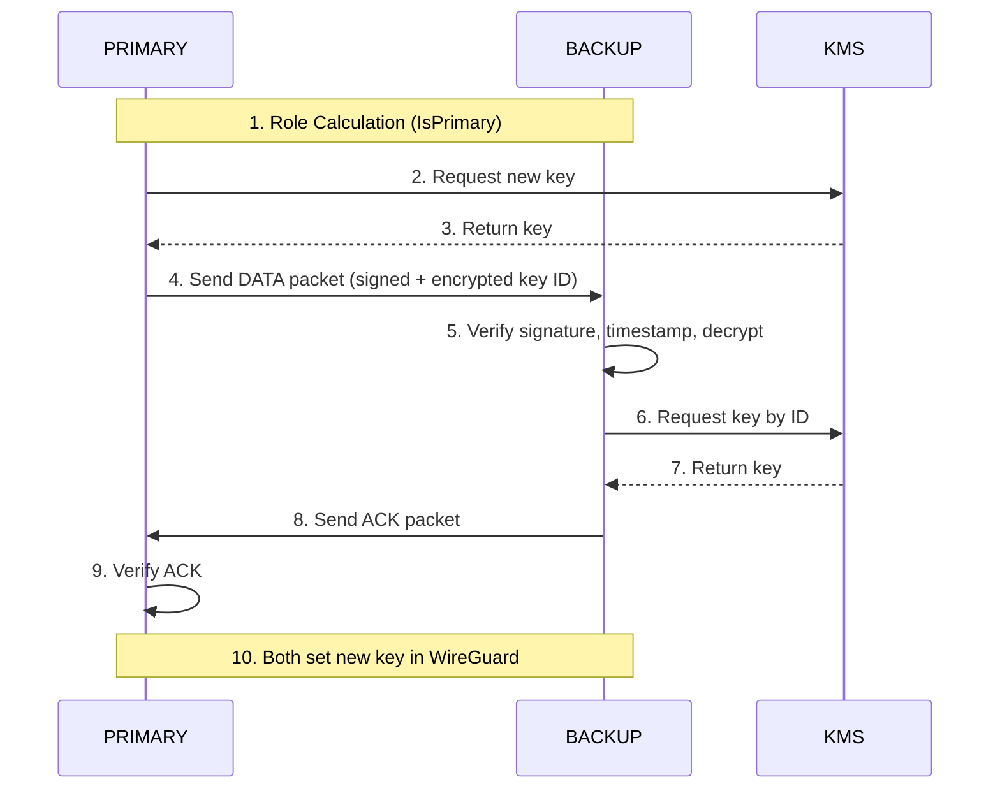

# CODEFLOW.md

## Arnika Key Exchange Protocol – Code Flow

This document describes the step-by-step code flow of the Arnika key exchange protocol, including a flow diagram and references to the relevant code sections.

The exchange runs over **UDP** between `LISTEN_ADDRESS` and the peer's `SERVER_ADDRESS`
(`udpserver.go`). Every packet is signed and encrypted with keys derived from the shared secret
`ARNIKA_PSK`, which therefore must be identical on both peers — see
[`SECURITY.md`](SECURITY.md#inter-peer-channel-authentication-arnika_psk).

---

## Flow Diagram

```mermaid
sequenceDiagram
    participant PRIMARY
    participant BACKUP
    participant KMS

    Note over PRIMARY,BACKUP: 1. Role Calculation (IsPrimary)
    PRIMARY->>KMS: 2. Request new key
    KMS-->>PRIMARY: 3. Return key
    PRIMARY->>BACKUP: 4. Send DATA packet (signed + encrypted key ID)
    BACKUP->>BACKUP: 5. Verify signature, timestamp, decrypt
    BACKUP->>KMS: 6. Request key by ID
    KMS-->>BACKUP: 7. Return key
    BACKUP->>PRIMARY: 8. Send ACK packet
    PRIMARY->>PRIMARY: 9. Verify ACK
    Note over PRIMARY,BACKUP: 10. Both set new key in WireGuard
```

---

## Step-by-Step Code Flow

### 1. **Role Calculation**
- **Where:** `config/config.go` (`IsPrimary()` method)
- **What:** Both nodes deterministically calculate their role (PRIMARY or BACKUP) for the current interval as `HMAC-SHA256(ARNIKA_PSK, intervalNumber)` XOR `ARNIKA_ID`, taking the lowest bit.
- **Why:** Ensures only one node acts as PRIMARY per interval, preventing race conditions.
- **Requires:** the same `ARNIKA_PSK` and the same `INTERVAL` on both peers, and `ARNIKA_ID` values of **different parity** — only the lowest bit of the ID enters the calculation, so two even or two odd IDs give both nodes the same role in every interval.

### 2. **PRIMARY Requests Key from KMS**
- **Where:** `main.go`, via `services.KeyReaderService` (`repositories/kms.go`)
- **What:** PRIMARY node requests a new key from the Key Management Server (KMS).
- **Why:** Only PRIMARY initiates key rotation.

### 3. **KMS Returns Key**
- **Where:** `repositories/kms.go`
- **What:** KMS responds with the new key.
- **Why:** PRIMARY needs the key to start the exchange.

### 4. **PRIMARY Sends DATA Packet**
- **Where:** `auth/auth.go` (`PacketData`, `Encrypt`, `Packet.Marshal`)
- **What:** PRIMARY encrypts the key ID with AES-256-GCM, signs the packet with HMAC-SHA256, and sends it to BACKUP.
- **Why:** Single roundtrip — securely transmits key material in one step.

### 5. **BACKUP Verifies DATA, Decrypts Key**
- **Where:** `auth/auth.go` (`UnmarshalPacket`, `Verify`, `Decrypt`)
- **What:** BACKUP checks rate limit, Base64 decodes, verifies HMAC signature, checks timestamp, then decrypts the payload.
- **Why:** Layered security — cheapest checks first, expensive decryption only after authentication passes.

### 6. **BACKUP Requests Key from KMS**
- **Where:** `main.go` (`GetKeyByID`), `repositories/kms.go`
- **What:** BACKUP requests the key from KMS using the key ID.
- **Why:** Ensures both nodes have the same key.

### 7. **KMS Returns Key**
- **Where:** `repositories/kms.go`
- **What:** KMS responds with the key.
- **Why:** Synchronizes key material.

### 8. **BACKUP Sends ACK Packet**
- **Where:** `auth/auth.go` (`PacketAck`, `Packet.Marshal`)
- **What:** BACKUP sends an ACK to PRIMARY.
- **Why:** Confirms successful key receipt and setup.

### 9. **PRIMARY Verifies ACK**
- **Where:** `auth/auth.go` (`UnmarshalPacket`, `Verify`)
- **What:** PRIMARY checks the ACK packet.
- **Why:** Ensures BACKUP is synchronized.

### 10. **Both Set New Key in WireGuard**
- **Where:** `main.go` (`setPSK`), via `services.KeyWriterService` and the selected key writer adapter (`repositories/wireguard-*.go`)
- **What:** Both nodes update their WireGuard PSK. In hybrid mode the QKD key is first combined with the PQC key via `kdf.DeriveKey` (HKDF-SHA3-256).
- **Why:** Secure VPN communication.

---

## Security Mechanisms in Code

- **HMAC-SHA256:** Used for all packet signatures (`Sign`, `Verify`), keyed by `ARNIKA_PSK` with domain separation (`deriveHMACKey`).
- **AES-256-GCM:** Used for encrypting key material (`Encrypt`, `Decrypt`), keyed by `ARNIKA_PSK` (`deriveKey`).
- **Rate Limiting:** Per-IP token bucket checked before any crypto — `RATE_LIMIT` packets per `RATE_WINDOW`, default 30 per minute.
- **Timestamp Validation:** Replay protection over a ±`MAX_CLOCK_SKEW` window, default ±1m.
- **Zeroization:** All sensitive key material is handled inside `runtime/secret.Do` blocks to minimize memory exposure. This requires `GOEXPERIMENT=runtimesecret` at build time.

---

## PQC Key Agreement Round (`pqc-hpke`)

When `PQC_ENABLED=true`, a second exchange runs over the same socket as one
additional packet type (`PacketPQC`), producing the PQC half of the PSK. It is
independent of the QKD flow above: `setPSK()` simply consumes whichever key is
current.

```mermaid
stateDiagram-v2
  [*] --> Idle
  Idle --> AwaitEnc: round due (initiator) - keypair generated, public key sent
  Idle --> Encapsulating: public key received (responder)
  Encapsulating --> AwaitConfirm: enc sent, key derived
  Encapsulating --> Failed: malformed public key
  AwaitEnc --> Deriving: enc received and reassembled
  AwaitEnc --> Failed: round deadline exceeded
  Deriving --> AwaitConfirm: Export succeeded, 32 bytes, tag sent
  Deriving --> Failed: NewRecipient or Export error
  AwaitConfirm --> Publishing: peer tag matches (constant-time)
  AwaitConfirm --> Failed: tag mismatch - divergent keys
  AwaitConfirm --> Failed: round deadline exceeded
  Publishing --> Idle: publish, zero the private key and enc
  Failed --> Idle: log, keep the previous key until PQC_MAX_KEY_AGE
```

Three properties are worth stating explicitly:

- **Nothing is published before confirmation succeeds.** ML-KEM decapsulation
  never fails - a malformed encapsulation returns a pseudorandom key rather than
  an error - so the confirmation exchange is the only thing standing between a
  corrupted message and a silently divergent PSK.
- **The role is pinned at round start** from the round index. It is the same
  `IsPrimary` derivation used for the interval, evaluated once and held: it
  alternates per interval, so re-deriving it mid-round would flip initiator and
  responder in flight.
- **A failed round publishes nothing.** The previous key stays live until
  `PQC_MAX_KEY_AGE`, after which `GetNewKey()` errors and the existing `Mode`
  logic decides. No new fail-closed policy is introduced.

See [`docs/pqc-hpke.md`](docs/pqc-hpke.md) for the full module document.

---

## References

- **Packet Structure & Marshalling:**
  See `auth/auth.go` (`Packet`, `Marshal`, `UnmarshalPacket`)
- **Encryption/Decryption:**
  See `auth/auth.go` (`Encrypt`, `Decrypt`)
- **Signature Handling:**
  See `auth/auth.go` (`Sign`, `Verify`)
- **Key Derivation (peer channel):**
  See `auth/auth.go` (`deriveKey`, `deriveHMACKey`)
- **Key Derivation (hybrid QKD+PQC PSK):**
  See `kdf/kdf.go` (`DeriveKey`, HKDF-SHA3-256)
- **Configuration and role election:**
  See `config/config.go` (`Parse`, `IsPrimary`) and [`README.md`](README.md#configuration)
- **Key reader / key writer adapters:**
  See [`KEYCONTROL.md`](KEYCONTROL.md)

---
