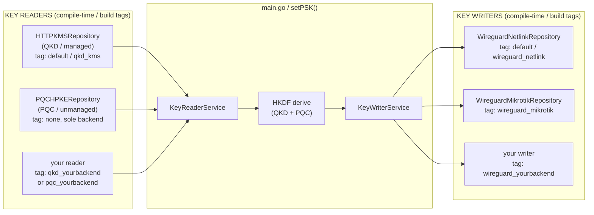

# KEYCONTROL.md

## Developing Key Reader and Key Writer Modules

This is the **developer guide** for Arnika's key I/O layer. It describes the
architecture that every key source and every key sink plugs into, the contracts
a module must satisfy, the naming and build conventions to follow, and the
step-by-step procedure for adding a new module.

It is deliberately **backend-agnostic**. Anything specific to one backend —
its configuration, its remote prerequisites, its build and deployment steps —
belongs in that module's own document under [`docs/`](docs/), never here.

> **Documentation rule:** every key reader and key writer module is documented
> in **exactly one** file at `docs/<module-name>.md`, where `<module-name>` is
> the name in the [Module Index](#module-index).
> For example the `wireguard-mikrotik` module →
> [`docs/wireguard-mikrotik.md`](docs/wireguard-mikrotik.md).
> The module name is not the adapter's file name, and not its package name:
> one package can hold more than one module, as
> [`repositories/wgnetlink/`](repositories/wgnetlink/) holds both
> `wireguard-netlink` and `wireguard-netlink-netns`.
> A module is not finished until that document exists.

---

## The Concept

Arnika follows a **ports-and-adapters** (hexagonal) design for key I/O:

- A **Key Reader** is a *source* of key material. It answers the question
  *"give me the next key"*. Examples: a QKD/KMS server, an HPKE key agreement
  with the peer.
- A **Key Writer** is a *sink* for key material. It answers the question
  *"install this PSK into WireGuard"*. Examples: the local WireGuard kernel
  interface, a remote MikroTik router.

Each side is a thin **service** (the port) wrapping a **repository** (the
adapter). The service defines a small interface; each backend is one
implementation of that interface. [`main.go`](main.go) only ever talks to the
services, so adding or replacing a backend never changes the core key-exchange
logic.



**Every port is selected at compile time**, one build tag family per port, so a
binary carries exactly the backends it uses and nothing else. What stays a
runtime decision is only *policy*: `MODE` and `PQC_ENABLED` decide which of the
compiled-in readers must contribute to the PSK.

---

## Platform Support

Arnika distinguishes two classes of platform, and the distinction decides what a module is
allowed to do when a dependency is not portable:

| Class | Platforms | Meaning |
| --- | --- | --- |
| **Supported** | `linux/amd64`, `linux/arm64` | Deployment targets. Released, integration-tested, documented. |
| **Build-only** | `darwin/amd64`, `darwin/arm64` | Must **compile**, so that maintainers can build, test and run editor tooling on macOS. Not a deployment target, and never exercised against a real kernel. |

Both classes are covered by the `build` matrix in
[`.github/workflows/ci.yml`](.github/workflows/ci.yml). `test`, `lint` and the integration
jobs run on Linux only, which makes **Linux the reference platform** for every correctness
check.

A backend whose dependency does not build on a build-only platform carries a platform
constraint (see [rule 2](#naming-and-file-layout-conventions)). It does **not** cause that
platform to be dropped from CI: the darwin entries exist precisely to catch a non-portable
dependency leaking into a package that `main` imports, and removing them removes the
signal.

---

## Module Index

| Module | Kind | Adapter | Build tag | Platform | Document |
| --- | --- | --- | --- | --- | --- |
| `kms` | Reader (managed) | [`repositories/kms/kms.go`](repositories/kms/kms.go) | *(default)* / `qkd_kms` | any | *pending* — see [`KMS.md`](KMS.md) |
| `pqc-hpke` | Reader (unmanaged) | [`repositories/pqchpke/pqchpke.go`](repositories/pqchpke/pqchpke.go) | *(none, sole PQC backend)* | any | [`docs/pqc-hpke.md`](docs/pqc-hpke.md) |
| `wireguard-netlink` | Writer | [`repositories/wgnetlink/netlink.go`](repositories/wgnetlink/netlink.go) | *(default)* / `wireguard_netlink` | linux *(compiles elsewhere, no device)* | [`docs/wireguard-netlink.md`](docs/wireguard-netlink.md) |
| `wireguard-netlink-netns` | Writer | [`repositories/wgnetlink/netns.go`](repositories/wgnetlink/netns.go) | `wireguard_netlink_netns` | linux | [`docs/wireguard-netlink-netns.md`](docs/wireguard-netlink-netns.md) |
| `wireguard-mikrotik` | Writer | [`repositories/wgmikrotik/mikrotik.go`](repositories/wgmikrotik/mikrotik.go) | `wireguard_mikrotik` | any | [`docs/wireguard-mikrotik.md`](docs/wireguard-mikrotik.md) |

---

## Code Map

| Concern | Port (service) | Adapter interface | Adapters (repositories) |
| --- | --- | --- | --- |
| Read keys | [`services/keyreader.go`](services/keyreader.go) `KeyReaderService` | `KeyReader`, plus the optional `KeyResolver` | [`repositories/kms/kms.go`](repositories/kms/kms.go), [`repositories/pqchpke/pqchpke.go`](repositories/pqchpke/pqchpke.go) |
| Write keys | [`services/keywriter.go`](services/keywriter.go) `KeyWriterService` | `keyWriterRepository` (`SetPSK`) | [`repositories/wgnetlink/netlink.go`](repositories/wgnetlink/netlink.go), [`repositories/wgmikrotik/mikrotik.go`](repositories/wgmikrotik/mikrotik.go) |

---

## Naming and File Layout Conventions

A module called `<module-name>` (lower-case, dash-separated) occupies a fixed
set of paths. Following them is what makes a module discoverable:

| Path | Purpose | Backend-selection tag? |
| --- | --- | --- |
| `repositories/<pkg>/` | The adapter's own package, all backend logic | **No**, always compiled. May carry a *platform* constraint |
| `repositories/<pkg>/<name>_test.go` | Adapter unit tests | **No**, always run. Same platform constraint as the adapter |
| `wire_<moduletag>.go` (repo root) | Wiring: the `getQKDService`, `getPQCService` or `getKeyWriterService` factory | **Yes** |
| `docs/<module-name>.md` | The module's single document | (none) |

The wiring file name is `wire_` plus the build tag verbatim, so
`//go:build wireguard_netlink_netns` lives in `wire_wireguard_netlink_netns.go`.
The prefix keeps every composition file together at the top of the root
listing, and separates them from the protocol code that also lives there.

One package per adapter, and not one shared `repositories` package, because the
build tags then control **linkage** and not merely which wiring compiles: a
`qkd_none` build imports no `repositories/kms`, so `net/http` and `crypto/tls`
never enter its dependency graph.

Three rules follow from that table and are worth stating explicitly:

1. **The adapter is never excluded by a backend-selection tag.** Only the root wiring file
   carries a `qkd_*`, `pqc_*` or `wireguard_*` constraint. This keeps every adapter
   compiled, tested, vetted and linted on every ordinary `go test ./...` run on the
   reference platform, regardless of which backend the shipped binary selects.
2. **A platform constraint is a different thing, and is permitted.** A backend that
   depends on a platform-bound kernel feature or package constrains its adapter — and its
   test file — with an explicit `//go:build linux`, and its wiring file with
   `wireguard_<backend> && linux`:

   ```go
   //go:build linux

   // Platform constraint only: <dependency> is Linux-only.
   // This is not a writer-selection tag; the adapter still compiles,
   // vets, lints and tests on every ordinary `go test ./...` run.

   package <pkg>
   ```

   This does not weaken rule 1. Linux is the reference platform (see
   [Platform Support](#platform-support)), so a Linux-constrained adapter stays fully
   covered by `test` and `lint`. What rule 1 forbids is hiding an adapter behind the tag
   that *selects* it, because that would remove it from those jobs entirely.

   An equivalent `_linux.go` filename suffix also works and is idiomatic Go. Prefer the
   explicit `//go:build` line here, so a reader who knows rule 1 can see immediately that
   the constraint is deliberate and is not a writer-selection tag.
3. **Backend-specific configuration is read in the wiring file**, not in
   [`config/config.go`](config/config.go). The shared `config.Config` stays
   transport-agnostic; a backend that needs a URL, credentials, a CA bundle or a namespace
   path reads them from the environment behind its own build tag.

Build tags use the `wireguard_<backend>` form (underscores — Go build tags
cannot contain dashes), while file and document names use dashes.

---

## Key Readers (compile-time-selected via build tags)

The reader service distinguishes two flavours of source:

| Flavour | Interface | Semantics | Example backend |
| --- | --- | --- | --- |
| **Managed** | `KeyReaderManaged` | Keys carry an ID. `GetNewKey()` returns `(keyID, key)`; the peer can later fetch the same key with `GetKeyByID(keyID)`. | QKD via KMS (ETSI GS QKD 014) |
| **Unmanaged** | `KeyReaderUnmanaged` | Keys have no ID. `GetNewKey()` returns only the key. | PQC via HPKE with the peer |

```go
// services/keyreader.go
type KeyReaderUnmanaged interface {
    GetNewKey() (key []byte, err error)
}

type KeyReaderManaged interface {
    GetNewKey() (keyID string, key []byte, err error)
    GetKeyByID(keyID *string) (key []byte, err error)
}
```

Readers return **raw key bytes**, not base64. `KeyReaderService` wraps them
into a [`services.Key`](services/key.go) and tags it managed or unmanaged; the base64
encoding happens once, in `setPSK`, immediately before handing the PSK to the
writer.

### The reader families

A reader port whose family has more than one backend selects exactly one wiring
file per build, and that file defines exactly one factory:

| Port | Factory | Wiring file | Build constraint |
| --- | --- | --- | --- |
| QKD (managed) | `getQKDService` | [`wire_qkd_kms.go`](wire_qkd_kms.go) | `qkd_kms \|\| !qkd_none` |
| | | [`wire_qkd_none.go`](wire_qkd_none.go) | `qkd_none` |
| PQC (unmanaged) | `getPQCService` | [`wire_pqc_hpke.go`](wire_pqc_hpke.go) | *(none, sole backend)* |

`wire_pqc_hpke.go` carries **no tag**, because a family with one member has nothing to
select. The preparation for a second PQC backend is the file *name*: adding, say,
`wire_pqc_tls.go` with `//go:build pqc_tls` means adding `//go:build pqc_hpke ||
!pqc_tls` to `wire_pqc_hpke.go`, and nothing else moves. Whether the one compiled-in
PQC reader contributes to the PSK stays a runtime decision (`PQC_ENABLED`).

The QKD family earns its tags, and `wire_qkd_none.go` is where the size goes.
Measured on `linux/amd64` with `-w -s`:

| Build | Size (bytes) | Saved |
| --- | --- | --- |
| default (netlink, kms, pqc-hpke) | 7 430 304 | (reference) |
| `qkd_none` | 4 477 088 | **-2.8 MB (-40 %)** |
| `wireguard_mikrotik` | 7 221 408 | (reference) |
| `qkd_none wireguard_mikrotik` | 6 918 304 | -296 KB |

The whole difference is `net/http` plus `crypto/tls`, which only the `kms`
reader needs. The mikrotik writer keeps them alive on its own, so dropping the
KMS reader saves little there. A PQC reader costs almost nothing next to that:
`crypto/tls` already pulls in ML-KEM, SHA-3 and the elliptic-curve stack.

The `qkdCompiled` constant is what lets the linker drop the code: `main.go`
guards the whole key_id flow with `if qkdCompiled`, a compile-time constant, so
in a `qkd_none` binary neither the flow nor the KMS client is emitted. Without
a QKD reader there is no `key_id` message and no PRIMARY/BACKUP alternation:
the PSK is set once per PQC round, in the middle of the part of the round
in which the scheduler never publishes (`nextPQCSetPSKAt`). Both peers derive
that instant from the wall clock alone, so this only keeps them on the same
key if the peers' clocks are synchronized (e.g. via NTP, see
[INSTALL.md](INSTALL.md)).

Which compiled-in reader must actually contribute to the PSK stays a **runtime**
decision (`MODE`, `PQC_ENABLED`). `Config.ValidateKeySources(qkdCompiled)` runs
right after `config.Parse()` and rejects a configuration this binary cannot
serve, for example the default `MODE=QkdAndPqcRequired` in a `qkd_none` build,
at startup rather than at the first rotation.

### Adding a new key reader

1. **Write the adapter** at `repositories/<module-name>.go` implementing either
   `KeyReaderManaged` or `KeyReaderUnmanaged`. Handle key material carefully:
   decode inside a `secret.Do(...)` block and `clear()` every intermediate
   buffer, as [`repositories/pqchpke/pqchpke.go`](repositories/pqchpke/pqchpke.go) does.
2. **Add a constructor** `New<Backend>Repository(...)` that takes everything it
   needs as arguments — no global state, no direct `os.Getenv` in the adapter.
3. **Add the wiring file** at the repo root, named after the tag, e.g.
   `wire_qkd_foo.go` with `//go:build qkd_foo`. It defines `get<Port>Service`, the
   `<port>Compiled` constant, and reads its own environment variables (see
   [rule 3](#naming-and-file-layout-conventions)). Assign the adapter to the
   matching interface variable and pass it to `services.NewKeyReaderService`.
4. **Update the default constraint** of the family, keeping the leading
   `qkd_kms ||` clause intact, so that two tags from one family still collide:

   ```go
   //go:build qkd_kms || (!qkd_none && !qkd_foo)
   ```

5. **Test** the adapter with `httptest` (network backends) or a `t.TempDir()`
   fixture (file backends).
6. **Document it** at `docs/<module-name>.md`, add a row to the
   [Module Index](#module-index), and add the tag to its family in the
   `readers` job of [`.github/workflows/ci.yml`](.github/workflows/ci.yml).

---

## Key Writers (compile-time-selected via build tags)

As with readers, only **one** key writer is compiled into any given binary, and
the choice is made with a Go **build tag**. This keeps each binary minimal and
platform-appropriate: the netlink writer assumes a local WireGuard kernel
module, while a remote-API writer talks over HTTPS and needs neither.
Compile-time selection means the unused backend's code and any of its
dependencies are simply not part of the shipped binary.

Every writer adapter implements the same two-method contract:

```go
// services/keywriter.go
type keyWriterRepository interface {
    InvalidateTunnel() error // Invalidate the WireGuard session by setting a random PSK
    SetPSK(psk string) error // Set the PSK on the WireGuard interface
}
```

**Contract notes for implementers:**

- `psk` arrives **base64-encoded** — 32 raw bytes, standard encoding. Pass it
  through as-is unless the backend needs another representation.
- `SetPSK` must be **idempotent and re-resolving**. It is called on every
  rotation interval, so resolve the target peer on each call rather than
  caching a handle or an internal id that a backend restart may invalidate.
- `InvalidateTunnel` is the **fail-safe**. `setPSK` in [`main.go`](main.go)
  calls it whenever no valid key material is available, and it must tear the
  session down by installing a fresh random 32-byte PSK. Generate it from
  `crypto/rand` (or the backend's own key generator) — never a fixed value.
- Errors are surfaced and logged by the caller; return wrapped errors with
  enough context to identify the interface and peer.

### The build-tag mechanism

The mechanism is a single factory function, `getKeyWriterService(cfg)`, that is
**defined in exactly one file**, chosen by build constraint:

| File | Build constraint |
| --- | --- |
| [`wire_wireguard_netlink.go`](wire_wireguard_netlink.go) | `//go:build wireguard_netlink \|\| (!wireguard_mikrotik && !wireguard_netlink_netns)` |
| [`wire_wireguard_mikrotik.go`](wire_wireguard_mikrotik.go) | `//go:build wireguard_mikrotik` |
| [`wire_wireguard_netlink_netns.go`](wire_wireguard_netlink_netns.go) | `//go:build wireguard_netlink_netns` |

`main.go` calls `getKeyWriterService(cfg)` without knowing which file provides
it. The constraints are designed so that netlink is the **default** and so that
you can never accidentally compile two writers at once:

| `-tags` passed | netlink | mikrotik | netns | Result |
| --- | :---: | :---: | :---: | --- |
| *(none)* | ✅ (negated clause) | ❌ | ❌ | **netlink** (default) |
| `wireguard_netlink` | ✅ | ❌ | ❌ | **netlink** (explicit) |
| `wireguard_mikrotik` | ❌ | ✅ | ❌ | **mikrotik** |
| `wireguard_netlink_netns` | ❌ | ❌ | ✅ | **netns** |
| any two writer tags | ✅ or ❌ | | | ❌ **compile error**, `getKeyWriterService redeclared` |

The last row is intentional: requesting both backends is a mistake, and the
duplicate-symbol error catches it at build time rather than silently picking one.

This is a **load-bearing property, not a side effect** — the writer decides which
interface receives the PSK, so "two tags silently pick one" is exactly the class of mistake
that must not survive a build.

> [!WARNING]
> The property only holds while the default keeps its leading `wireguard_netlink ||`
> clause. Writing the constraint as a bare conjunction of negations looks equivalent and
> selects the same writer for every *single* tag, but it makes the netlink file lose to
> every other tag instead of colliding with it, so the conflicting pairs build silently.
> The `writers` job in [`.github/workflows/ci.yml`](.github/workflows/ci.yml) asserts every
> pair still fails; do not change this constraint without running it.

### Adding a new key writer

1. **Write the adapter** at `repositories/<module-name>.go` implementing
   `SetPSK` and `InvalidateTunnel` as described above. Do **not** put a
   writer-selection tag on this file. Take the HTTP client (or equivalent
   transport) as a constructor argument so that TLS trust and timeouts are
   configured once, at the wiring layer.

   If the backend depends on something that does not build on every platform in
   [Platform Support](#platform-support), add `//go:build linux` to the adapter and its
   test file, per [rule 2](#naming-and-file-layout-conventions). Check it the way CI does:

   ```bash
   GOOS=darwin GOARCH=arm64 CGO_ENABLED=0 GOEXPERIMENT=runtimesecret go build ./...
   ```

2. **Add the wiring file** at the repo root, named after the tag, e.g.
   `wire_wireguard_foo.go`:

   ```go
   //go:build wireguard_foo
   // ... or, for a platform-bound backend: wireguard_foo && linux

   package main

   func getKeyWriterService(cfg *config.Config) (*services.KeyWriterService, error) {
       // read backend-specific env vars here, build the transport,
       // then: return services.NewKeyWriterService(repo), nil
   }
   ```

   Fail fast: return a descriptive error for every missing mandatory setting
   rather than letting the first key rotation discover it.

3. **Update the default constraint.** So that exactly one writer compiles, add
   your tag to the *negated* clause of the netlink default in
   [`wire_wireguard_netlink.go`](wire_wireguard_netlink.go), **keeping the leading
   `wireguard_netlink ||` clause intact**:

   ```go
   //go:build wireguard_netlink || (!wireguard_mikrotik && !wireguard_foo)
   ```

   Dropping that leading clause silently disables the duplicate-symbol trap — see the
   warning under [The build-tag mechanism](#the-build-tag-mechanism).

4. **Add tests** at `repositories/<module-name>_test.go`. For a network
   backend, stand up an `httptest.Server` that impersonates the remote API and
   assert on the requests the adapter makes — see
   [`repositories/wgmikrotik/mikrotik_test.go`](repositories/wgmikrotik/mikrotik_test.go)
   for a worked example, including the check that `InvalidateTunnel` produces a
   fresh 32-byte key on each call.

5. **Verify the wiring compiles.** `go test ./...` and `golangci-lint` run
   against the **default (netlink) build**, so a tagged wiring file is not
   covered by them. Check it explicitly:

   ```bash
   GOEXPERIMENT=runtimesecret go vet -tags wireguard_foo ./...
   GOEXPERIMENT=runtimesecret go build -tags wireguard_foo .
   ```

   And confirm the safety net still fires — this must fail with a duplicate
   `getKeyWriterService`:

   ```bash
   GOEXPERIMENT=runtimesecret go build -tags "wireguard_netlink wireguard_foo" .
   ```

6. **Document it** at `docs/<module-name>.md` and add a row to the
   [Module Index](#module-index).

7. **Optionally add a Makefile target** mirroring `build-mikrotik`. This is a
   convenience only — the generic form below always works without touching the
   [`Makefile`](Makefile).

---

## Building a Selected Backend

The [`Makefile`](Makefile) exposes every tag through the `BUILD_TAGS` variable,
so any combination of backends can be built without editing it. One tag per
family at most; an unnamed family keeps its default:

```bash
make                                              # netlink + kms + pqc-hpke (all defaults)
make build BUILD_TAGS=wireguard_mikrotik          # generic form, works for any tag
make build BUILD_TAGS="wireguard_mikrotik qkd_none"   # one tag per family
make build-netlink                                # netlink (convenience target)
make build-mikrotik                               # mikrotik (convenience target)
make build-pqc-only                               # qkd_none: no KMS client, 40 % smaller
```

Equivalently, with `go build` directly:

```bash
GOEXPERIMENT=runtimesecret go build .                             # all defaults
GOEXPERIMENT=runtimesecret go build -tags wireguard_mikrotik .    # mikrotik writer
GOEXPERIMENT=runtimesecret go build -tags qkd_none .              # PQC-only reader
```

> **`GOEXPERIMENT=runtimesecret` is mandatory for every `go` command** —
> `build`, `test` and `vet` alike. Arnika imports `runtime/secret` to keep key
> material out of memory dumps, and without the experiment enabled the build
> fails with `build constraints exclude all Go files in .../runtime/secret`.
> The `Makefile` sets it for you; export it once in a shell that runs `go`
> directly. `golangci-lint` needs no env var — [`.golangci.yml`](.golangci.yml)
> already carries the `goexperiment.runtimesecret` build tag.

The build is pure Go (`CGO_ENABLED=0`), so any platform can be targeted by
setting `GOOS`/`GOARCH` — no cross C-toolchain is required. The version string
is stamped into `main.Version` at link time with `-X 'main.Version=…'` (the
`Makefile` derives it from `git describe --tags --always`). Which tag a binary
was built with can be read back with `go version -m <binary>`.

```bash
# Linux arm64, tag from the module's own document, version from git describe
GOOS=linux GOARCH=arm64 make build BUILD_TAGS=wireguard_mikrotik

# Same, with an explicit version override
GOOS=linux GOARCH=arm64 VERSION=v2.0.0a make build BUILD_TAGS=wireguard_mikrotik
```

### Build tag reference

Every tag Arnika currently understands. At most **one tag per family**; a family
that is not named keeps its default:

| Family | Tag | Default | Effect |
| --- | --- | :---: | --- |
| Key writer | `wireguard_netlink` | ✅ | Local kernel WireGuard interface via `wgctrl` |
| | `wireguard_netlink_netns` | | Same, inside a network namespace (`linux` only) |
| | `wireguard_mikrotik` | | MikroTik RouterOS REST API |
| QKD reader | `qkd_kms` | ✅ | KMS client, ETSI GS QKD 014 |
| | `qkd_none` | | No QKD reader: PQC-only, 40 % smaller, requires `MODE=AtLeastPqcRequired` and no `KMS_URL` |

The PQC reader has one backend and therefore no tag; `PQC_ENABLED` switches it
at runtime. Two tags from one family fail the build with a redeclared factory.

Per-backend build recipes, including the exact output names and any
backend-specific constraints, belong in `docs/<module-name>.md`.

---

## Module Checklist

Before considering a module done:

- [ ] Adapter at `repositories/<module-name>.go`, **without** a backend-selection tag
- [ ] Platform-bound backends: `//go:build linux` on the adapter *and* its test file,
      `wireguard_<tag> && linux` on the wiring, and a **Platform** row in
      `docs/<module-name>.md`
- [ ] `GOOS=darwin go build ./...` passes (build-only platform stays green)
- [ ] Constructor takes all dependencies as arguments (no global state)
- [ ] Key material cleared with `clear()` / handled inside `secret.Do(...)`
- [ ] Writers: `SetPSK` re-resolves its target on every call
- [ ] Writers: `InvalidateTunnel` installs a fresh random 32-byte PSK
- [ ] Wiring file added, and its family's default constraint updated (`wire_wireguard_netlink.go`
      or `wire_qkd_kms.go`; `wire_pqc_hpke.go` gets its first constraint with a second PQC backend),
      keeping the leading `<tag> ||` clause
- [ ] Readers that can be absent from a build: a `<port>Compiled` constant in the wiring
      file, and a `ValidateKeySources` case for the modes it cannot serve
- [ ] Backend config read in the wiring file, not in `config.Config`
- [ ] Tests at `repositories/<module-name>_test.go` pass under `go test ./...`
- [ ] `go vet -tags <tag> ./...` and `go build -tags <tag> .` pass
- [ ] Every `go` command above run with `GOEXPERIMENT=runtimesecret`
- [ ] Building with two tags from the same family still fails with a duplicate symbol,
      for **every** pair, not just the one you added
- [ ] Tag added to the `writers` job (with its supported `GOOS` values) or to its family
      in the `readers` job of [`.github/workflows/ci.yml`](.github/workflows/ci.yml)
- [ ] Long-lived resources released: anything opened per `SetPSK` call is closed on every
      path, including the error paths
- [ ] `docs/<module-name>.md` written, including a **Platform** row
- [ ] Row added to the [Module Index](#module-index), with its Platform value

---

## References

- Key exchange protocol flow: [`CODEFLOW.md`](CODEFLOW.md)
- KMS / QKD integration: [`KMS.md`](KMS.md)
- Security model and key handling: [`SECURITY.md`](SECURITY.md)
- Deployment: [`INSTALL.md`](INSTALL.md)
- Go build constraints: <https://pkg.go.dev/cmd/go#hdr-Build_constraints>
