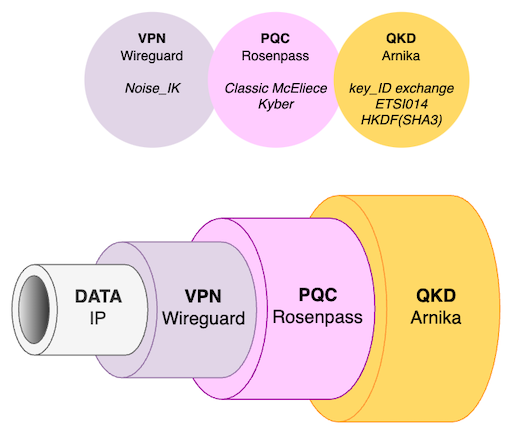
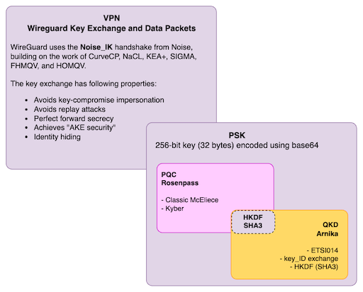
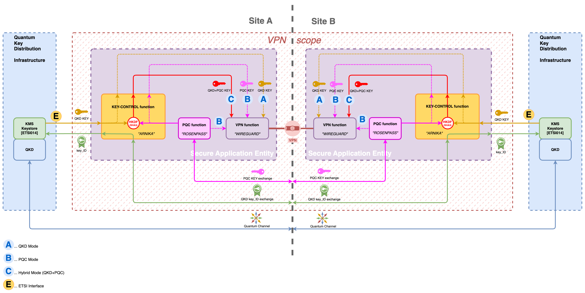

<!--
# Arnika - Quantum secure VPN

-->

<div align="center">
    
    <h1> Arnika - Quantum secure VPN</h1>
</div>

> [!NOTE]
> Meet us at the [QCI Days 2026 28.09.- 30.9.2026](https://qci-days.eu/) in Padua , Italy
>

> [!IMPORTANT]
> The new version `v2.x`, is already available on the main branch, but the documentation may lag behind.
> For classic Arnika, use the `v1.x` branch.

**Arnika** is a compact, **lightweight external extension for Wireguard VPN**, engineered to incorporate symmetric keys as Pre-Shared Keys (**PSK**) into Wireguard. This integration ensures the establishment of a quantum-secure VPN (safeguarding against compromise of session keys).

It gathers a 256-bit symmetric encryption key from a Key Management System (**KMS**) within a Quantum Key Distribution (**QKD**) infrastructure, shares the associated key ID with an Arnika peer, and configures an additional Pre-Shared Key (**PSK**) for Wireguard using the obtained key material.

Arnika offers an additional security layer for cryptography enthusiasts. It can integrate Post-Quantum Cryptography (**PQC**) by leveraging a PQC key provided by an external PQC framework. This key is then used to create an even stronger Preshared Key (PSK) for WireGuard. This PSK benefits from both **PQC** and **QKD**, offering enhanced protection against potential security threats.

Arnika integrates with WireGuard to establish quantum-resistant VPN connections, adding a significant layer of security to your communication

Arnika v1.x has been developed in scope of EU **EUROQCI** / **QCI-CAT** research program for the Use-Case **HSM BACKUP USING QKD** - <https://qci-cat.at/hsm-backup-using-qkd>

## Contact

If you want to contact us, feel free to join the public **Matrix** room `#arnika:matrix.org` ([https://matrix.to/#/#arnika:matrix.org](https://matrix.to/#/#arnika:matrix.org)) or `arnika` channel on **IRC** `irc.oftc.net` or send us an email at <arnika@unbox.at> .

## Quantum secure VPN

<table border="0" cellpadding="0" cellspacing="0">
  <tr>
    <td align="center">
        <a href="img/Arnika-Encapsulations-pipe.png"></a>
        <br/><em>Figure 1</em>
    </td>
    <td align="center">
        <a href="img/Arnika-Wireguard-PSK.png"></a>
        <br/><em>Figure 2</em>
    </td>
  </tr>
</table>

## Wireguard + PQC + Arnika

SAE (Secure Application Entity) = Wireguard + PQC + Arnika

### QKD and PQC to achieve quantum resistance

The approach of combining symmetric keys from Quantum Key Distribution (QKD) and/or Post-Quantum Cryptography (PQC) with [WireGuard](https://www.wireguard.com/) as preshared key (PSK) has been used to enhance the security to achieve a post-quantum secure VPN.

### QKD | PQC key handling

The setup supports 3 operational modes, A, B, and C

* (A) ... QKD mode
* (B) ... PQC mode
* (C) ... QKD+PQC hyprid mode

At runtime the mode is selected with the `MODE` environment variable, which expresses what Arnika
is allowed to fall back to if one key source fails:

| Mode | `MODE` value | Key sources | Behaviour |
| --- | --- | --- | --- |
| (A) QKD | `AtLeastQkdRequired` | QKD, PQC optional | QKD key is mandatory; PQC is mixed in unless `PQC_ENABLED=false` |
| (B) PQC | `AtLeastPqcRequired` | PQC, QKD optional | PQC key is mandatory, so `PQC_ENABLED` must stay enabled |
| (C) hybrid | `QkdAndPqcRequired` _(default)_ | QKD **and** PQC | Both keys mandatory — no fallback, the strictest mode |
| — | `EitherQkdOrPqcRequired` | QKD **or** PQC | Either source alone is accepted; the weakest mode |

When a source that the mode treats as **mandatory** cannot deliver, the interval fails and the tunnel is
invalidated with a random PSK, so a failed rotation never extends the life of the key it was meant to
replace. When a source the mode treats as **optional** cannot deliver, rotation carries on from the
other one: without QKD the two peers install the PQC-only PSK on an instant they both derive from the
wall clock, because the `key_id` message that normally puts them on the same key is exactly what a KMS
outage takes away. This only lands both peers on the same instant if their clocks are kept in sync
(e.g. via NTP, see [INSTALL.md](INSTALL.md)).

Regardless of the selected mode, WireGuard always receives a single 256bit (32byte) key as PSK which is used for WireGuard internal `MixKeyAndHash()` using **HKDF**.

_Figure 3_ shows the key path of 2 interconnected sites for the hyprid mode (C) (QKD+PQC). In this scenario, the **KEY-CONTROL function** serves as a control entity, responsible for obtaining a **key** and transferring it to the encryption function (WireGuard).

<table border="0" cellpadding="0" cellspacing="0" width="100%">
  <tr>
    <td align="center">
        <a href="img/QKD-PQC-functions_post-quantum-secure-VPN.png"></a>
        <br/><em>Figure 3</em>
    </td>
  </tr>
</table>

The QKD key is obtained via ETSI014 from the QKDs embedded KMS. The PQC key is agreed by Arnika itself with its peer, using HPKE (RFC 9180) with the MLKEM1024-P384 hybrid KEM over the existing Arnika socket — see [`docs/pqc-hpke.md`](docs/pqc-hpke.md). Earlier releases read it from a file written by an external PQC provider; that mechanism has been replaced.

Subsequently, the **KEY-CONTROL function** uses the **QKD key** and **PQC key** by using a **HKDF HMAC Key Derivation Function** with SHA3-256 as the hash function, to derive a single key from the two input keys (QKD, PQC).
The specific derivation function, whether **HKDF** or an alternative, is a topic open for discussion among cryptographic experts.

## Portability

Arnika, as of v2.x, is based on hexagonal architecture (Ports and Adapters) and provides the capability to develop custom key-reader and key-writer adapters. See [`KEYCONTROL.md`](KEYCONTROL.md) for details.

<table border="0" cellpadding="0" cellspacing="0" width="100%">
  <tr>
    <td align="center">
        <a href="img/Arnika-keycontrol.png"></a>
        <br/><em>Figure 4</em>
    </td>
  </tr>
</table>

# Advantages

QKD/PQC operation on **Layer 3** offers several notable advantages:

* Very low keyrate -> 1key per 120seconds (Rekey-After-Time, Rekey-After-Messages)
* PQC/QKD keys can be injected as preshared key at runtime by design
* no change in existing WireGuard setups
* L3 based VPN can go over any existing, affortable, foreign infrastructure over the internet
* PQC crypto agility
* unaffected by patent "Method of integrating QKD with IPSec" (US7602919B2,CN101142779A,...)

# Improvements since v2.x (>v1.x)

* Hexagonal Architecture (Ports & Adapters) provides capability to develop own key-reader and key-writer adapters - see [`KEYCONTROL.md`](KEYCONTROL.md) for details.
* In-band PQC key agreement (**pqc-hpke**) - Arnika negotiates the PQC key directly with its peer using HPKE ([RFC 9180](https://www.rfc-editor.org/rfc/rfc9180.html)) with the MLKEM1024-P384 hybrid KEM, carried inside the existing authenticated UDP envelope. No external PQC provider, no PQC key on disk, no additional port, and no third-party dependency - the whole cryptographic path is the Go standard library. A fresh key pair every round gives forward secrecy, and a mandatory key-confirmation step catches ML-KEM implicit rejection before anything is published - see [`docs/pqc-hpke.md`](docs/pqc-hpke.md) for details.
* The PRIMARY installs a QKD key only after the peer confirms it installed the same key, so both ends switch within one packet of each other and a failed lookup on one side never leaves the other on a key it does not share
* symmetric-PSK based (_quantum secure_) mutual authentication of Arnika peers - (HMAC-SHA256 + AES-256-GCM authenticated UDP protocol), with per-direction key separation so a reflected packet fails at its own sender
* Arnika listening port is undetectable and unscannable, like wireguard
* Per-IP UDP rate limiting against flood/DoS attempts
* Memory hardening — key material is explicitly zeroed after use (`runtime/secret`)
* KMS request retry with exponential backoff for resilience

# Live Demo

A public, interactive demo using Arnika end to end is available at **[PQC-QKD Hybrid PoC](https://pqc-qkd-hybrid.daemons.jp/)**, built and operated by **Amon Koike**.

The **PQC-QKD Hybrid PoC** implements a three-layer hybrid QKD-PQC key model:

1. **QKD layer** — a `bb84-kme` simulator delivers QKD keys over an ETSI GS QKD 014 interface.
2. **PQC layer** — a PQC sidecar on each node produces post-quantum keys (Classic McEliece 460896 + Kyber512).
3. **Transport layer** — Arnika fuses both key sources with `HKDF-SHA3-256` (QKD ‖ PQC) and installs the result through its key-writer adapters.

Two VPN lanes consume the fused key in parallel:

* **WireGuard**, where the key is installed as a preshared key and enters the `Noise_IKpsk2` chaining key (ChaCha20-Poly1305).
* **IPsec/IKEv2** via strongSwan's VICI socket, where the key is used as an RFC 8784 Post-quantum Preshared Key alongside RFC 9370 ML-KEM-768 (AES-GCM-256).

The **Console** section exposes live views of the layered architecture, container status, BB84 key generation, key flow, network topology, benchmarks, physics parameters, a PQC validator, verification runs and hardware-in-the-loop tests. Key rotation is configured at 30 seconds.

---

# Requirements

The `Secure Application Entity` consists of following components running on a secure and hardened linux system:

* WireGuard
* Arnika
* PQC (optional)

## WireGuard

WireGuard must be installed/setup separately before Arnika can be used. For further installation instructions, refer to the [WireGuard](https://www.wireguard.com/) homepage.

## PQC

PQC is optional, Arnika can run without PQC, then it will run in QKD mode only.
For further installation instructions, refer to the PQC key provider.

## golang version

Go **1.26 or newer** is required (see `go.mod`).

> [!IMPORTANT]
> Arnika uses the `runtime/secret` package for memory hardening, which is gated behind a Go
> experiment. **Every `go` command must be run with `GOEXPERIMENT=runtimesecret`:**
>
> ```bash
> GOEXPERIMENT=runtimesecret go build .
> GOEXPERIMENT=runtimesecret go test ./...
> ```
>
> `make build` sets it for you. Building without it fails on the `runtime/secret` import.

# Limitations for version v1.x (<v2.x)

> [!IMPORTANT]
> This section describes **v1.x** only. In v2.x the key writer is an adapter (see
> [`KEYCONTROL.md`](KEYCONTROL.md)), so the same-host restriction applies to the default netlink
> key writer, not to Arnika as a whole, the MikroTik key writer can install the PSK on a **remote** or **local**
> RouterOS router over the REST API.

<!-- -->

> [!IMPORTANT]
> **ARNIKA** is intended to supply a **PSK** exclusively to a local WireGuard instance.
>
> As a result, **WireGuard** and **ARNIKA** are required to operate on the same host and kernel instance.
>
> A race condition may occur if **ARNIKA** is started in development environments on the same host at _exactly_ the same time.
> This is intentional and a consequence of the simple yet robust state mechanism.
> This will be changed in an upcoming major release and it has no impact on production and can be avoided by starting both with a random delay and using the recommended interval values.
>

---

# Documentation

| Document | Contents |
| --- | --- |
| [`KEYCONTROL.md`](KEYCONTROL.md) | Developer guide for the key reader / key writer layer |
| [`docs/pqc-hpke.md`](docs/pqc-hpke.md) | The PQC key agreement (HPKE) that replaces the external PQC provider |
| [`docs/`](docs/) | One document per key reader / key writer backend |
| [`CODEFLOW.md`](CODEFLOW.md) | The inter-peer key exchange protocol, step by step |
| [`KMS.md`](KMS.md) | The bundled ETSI GS QKD 014 KMS simulator |
| [`SECURITY.md`](SECURITY.md) | Security policy, threat scope, deployment checklist |
| [`CONTRIBUTING.md`](CONTRIBUTING.md) | Contribution guidelines |
| [`INSTALL.md`](INSTALL.md) | Step-by-step deployment guide: Ubuntu, build from source, systemd, two peers |

---

# Install golang

Arnika requires **Go 1.26+**. Distribution packages are usually older than that, so install the
official toolchain from [go.dev/dl](https://go.dev/dl/):

## Ubuntu / Debian (amd64)

```bash
GOVER=1.26.0            # or any newer 1.26+ release
curl -fsSLO https://go.dev/dl/go${GOVER}.linux-amd64.tar.gz
sudo rm -rf /usr/local/go && sudo tar -C /usr/local -xzf go${GOVER}.linux-amd64.tar.gz
export PATH=/usr/local/go/bin:$PATH
```

```shell
$ go version
go version go1.26.0 linux/amd64
```

> [!CAUTION]
> The golang version shipped by older distributions does not meet the requirements. Building with
> a too-old toolchain fails while reading `go.mod`:
>
> ```shell
> $ go version
> go version go1.18.1 linux/amd64
> $ make build
> /home/arnika/arnika/go.mod:3: invalid go version '1.26': must match format 1.23
> ```

---

# Build binaries from source

> [!NOTE]
> **Arnika** and **kms** (mock) can be downloaded as a compiled binary from the release page and run without the need for golang.

Following steps are required to build the binaries from source.

The binaries can be copied to the target system (matching architecture) or directory and executed.
No further dependencies are required, all necessary libraries are statically linked, and the binaries are self-contained.

The configuration for **Arnika** is done via environment variables.

# compile Arnika

```bash
git clone git@github.com:arnika-project/arnika.git
cd arnika
go mod tidy
make build
```

```shell
nean@qcicat01:~/arnika$ make build
Building arnika
CGO_ENABLED=0 GOEXPERIMENT=runtimesecret go build -trimpath -ldflags "-w -s -extldflags=-Wl,-Bsymbolic -X 'main.Version=v2.0.0-45-g9da5031' -X 'main.APPName=arnika'"  -o build/arnika .
```

The result is a single binary `arnika` located in the new created subdirecory `build` (`build/arnika`).

`make build` selects the **netlink** key writer plus the KMS key reader, both chosen at
compile time via build tags, one tag per family:

```bash
make build                                             # all defaults: netlink + kms + pqc-hpke
make build-netlink                                     # netlink writer (explicit)
make build-mikrotik                                    # MikroTik RouterOS REST API writer
make build-pqc-only                                    # qkd_none: no KMS client, 40 % smaller
make build BUILD_TAGS="wireguard_mikrotik qkd_none"    # long form, any combination
```

The full tag list, including the namespaced netlink writer
(`wireguard_netlink_netns`), is the build tag reference in
[`KEYCONTROL.md`](KEYCONTROL.md#build-tag-reference); see [`docs/`](docs/) for
the individual backends.

```shell
./build/arnika
=== Arnika Configuration ===
Arnika Mode:              QkdAndPqcRequired
Arnika Interval:          2m0s
Arnika ID:                9999
Arnika PSK:               (set, 44 bytes)
Arnika Listen Address:    127.0.0.1:9999
Arnika Peer Address:      127.0.0.1:9998
Arnika Peer Timeout:   500ms
KMS URL:                  http://localhost:8080/api/v1/keys/CONSA
KMS HTTP Timeout:         10s
KMS Backoff Max Retries:  5
KMS Backoff Base Delay:   100ms
KMS Retry Interval:       1m0s
Client Certificate:       (not configured)
Private Key:              (not configured)
CA Certificate:           (not configured)
PQC key provider:        DISABLED
WireGuard Interface:      qcicat0
WireGuard Peer PublicKey: ****************=
Rate Limit:               30
Rate Window:              1m0s
Max Clock Skew:           1m0s
============================
time=2026-01-22T18:04:40.628+01:00 level=INFO msg="requesting a new QKD key" arnika_id=9999 role=primary kms=http://localhost:8080/api/v1/keys/CONSA
time=2026-01-22T18:04:40.629+01:00 level=INFO msg="UDP server started" arnika_id=9999 address=127.0.0.1:9999
time=2026-01-22T18:04:40.635+01:00 level=INFO msg="sending the key_id to the peer" arnika_id=9999 role=primary key_id=ffffffff-fe92-4fdc-bef3-c0cdc73ff774 peer=127.0.0.1:9998
time=2026-01-22T18:04:40.636+01:00 level=INFO msg="PSK configured on WireGuard interface" arnika_id=9999 role=primary iface=qcicat0 peer=****************=
time=2026-01-22T18:04:43.399+01:00 level=INFO msg="received a key_id from the peer" arnika_id=9999 role=backup key_id=ffffffff-bcec-4858-838e-623c79eabf61 peer=127.0.0.1:58905
time=2026-01-22T18:04:43.399+01:00 level=INFO msg="requesting the QKD key for the peer's key_id" arnika_id=9999 role=backup key_id=ffffffff-bcec-4858-838e-623c79eabf61 kms=http://localhost:8080/api/v1/keys/CONSA
time=2026-01-22T18:04:43.399+01:00 level=INFO msg="PSK configured on WireGuard interface" arnika_id=9999 role=backup iface=qcicat0 peer=****************=
time=2026-01-22T18:04:55.399+01:00 level=INFO msg="received a key_id from the peer" arnika_id=9999 role=backup key_id=ffffffff-8a32-4540-9b78-7d4e1afebb5f peer=127.0.0.1:58927
```

> [!NOTE]
> The startup banner redacts `ARNIKA_PSK`, printing only its length.

## compile QKD KMS simulator

```bash
git clone git@github.com:arnika-project/arnika.git
cd arnika
go build -o build/kms ./tools
```

The result is a single binary `kms` located in the `build` subdirectory (`build/kms`). The
simulator does not use `runtime/secret`, so `GOEXPERIMENT` is not required to build it.

> [!Note]
> **kms** aka `mock` was originally designed to test **Arnika** and not intended to be a certified ETSI014 Simulator.
>
> However, since v2.x the KMS Simulator is compliant to the ETSI014 standard and can be tested with [ci/test-kms.sh](ci/test-kms.sh).
> It has been sucessfully tested with commercial security appliances from various vendors auch as like from **Palo Alto** or **MikroTik**. For more details contact <quantum@xbc-digital.com>
>
>
> pseudo values are used:
>
> * `http` only, no TLS
> * `CONSA` and `CONSB` as **SAE**
> * `key` and `key_ID`
> * key `size=256`
> * key `number=1`
>
> The listen address and debug logging are configurable — `LISTEN=host:port` (default `:8080`) and
> `DEBUG=true`. Everything else requires a source change. See [`KMS.md`](KMS.md) for the full
> endpoint matrix, ETSI GS QKD 014 compliance notes and test requests.

---

# Start Dev Environment

## Start QKD KMS Simulator

To start the simulator using Go:

```bash
go run tools/mock.go
```

Or, if you have already compiled the binary:

```bash
tools/kms
```

The QKD KMS simulator is now accessible at `http://127.0.0.1:8080`.

## Start Arnika #1

```bash
http_proxy=http://127.0.0.1:8080 \
no_proxy=127.0.0.1 \
LISTEN_ADDRESS=127.0.0.1:9999 \
SERVER_ADDRESS=127.0.0.1:9998 \
ARNIKA_ID=9999 \
ARNIKA_PSK="<same shared secret on both peers>" \
INTERVAL=120s \
KMS_URL="http://localhost:8080/api/v1/keys/CONSA" \
WIREGUARD_INTERFACE=qcicat0 \
WIREGUARD_PEER_PUBLIC_KEY="****************=" \
build/arnika
```

## Start Arnika #2

```bash
http_proxy=http://127.0.0.1:8080 \
no_proxy=127.0.0.1 \
LISTEN_ADDRESS=127.0.0.1:9998 \
SERVER_ADDRESS=127.0.0.1:9999 \
ARNIKA_ID=9998 \
ARNIKA_PSK="<same shared secret on both peers>" \
INTERVAL=120s \
KMS_URL="http://localhost:8080/api/v1/keys/CONSB" \
WIREGUARD_INTERFACE=qcicat0 \
WIREGUARD_PEER_PUBLIC_KEY="****************=" \
build/arnika
```

# Configuration

Arnika must be configured via environment variables. Defaults below are the values from
[`config/config.go`](config/config.go); variables marked ✅ have no default and Arnika refuses to
start without them.

## Peer identity and inter-peer channel

| Variable | Required | Default | Description |
| --- | --- | --- | --- |
| `LISTEN_ADDRESS` | ✅ | — | `host:port` Arnika listens on for the peer channel (UDP), e.g. `127.0.0.1:9999` |
| `SERVER_ADDRESS` | ✅ | — | `host:port` of the remote Arnika peer — its `LISTEN_ADDRESS` |
| `ARNIKA_PSK` | ✅ | — | Shared secret authenticating and encrypting the peer channel, minimum 32 bytes. **Must be identical on both peers** — see the warning below |
| `ARNIKA_ID` | ➖ | port from `LISTEN_ADDRESS` | Identifier (max 5 digits) used in logs and in PRIMARY/BACKUP election. The two peers' values **must differ in parity** — one odd, one even |
| `ARNIKA_PEER_TIMEOUT` | ➖ | `500ms` | Wait before the first resend of the key ID, doubled for each further resend. The PRIMARY waits for the peer's ACK, which confirms the peer installed the key, until the end of the current `INTERVAL` |
| `INTERVAL` | ➖ | `10s` | Interval between key rotations. **Must be the same on both peers**; align with the WireGuard rekey interval (`120s`) |
| `RATE_LIMIT` | ➖ | calculated | Max accepted packets per source IP per `RATE_WINDOW`. Unset, Arnika sizes it from `RATE_WINDOW`, `INTERVAL`, `PQC_ROUND_INTERVAL` and the protocol's own frame and retry counts (137 at `INTERVAL=5s` with PQC on and a one-minute window). Setting it is an operator override, and a value below the calculated budget starts with a warning naming both numbers |
| `RATE_WINDOW` | ➖ | `1m` | Window for the per-IP rate limit |
| `MAX_CLOCK_SKEW` | ➖ | `1m` | Accepted timestamp deviation (replay protection). Requires clocks in sync between peers |
| `LOG_LEVEL` | ➖ | `info` | `debug`, `info`, `warn` or `error`. Read before the rest of the configuration, because process hardening logs first. `debug` includes one line per rejected datagram, which flood traffic can drive: raise it only while diagnosing |

> [!WARNING]
> `ARNIKA_PSK` is mandatory and has **no default**: Arnika refuses to start if it is unset or
> shorter than 32 bytes. An empty value would derive both the HMAC and AES keys of the peer
> channel from the empty string, making them computable by anyone able to reach
> `LISTEN_ADDRESS`. Generate it with `openssl rand -base64 32`, distribute it out of band, and
> set the same value on both peers. A chosen passphrase is not acceptable.

## Key reader — QKD / KMS (ETSI GS QKD 014)

| Variable | Required | Default | Description |
| --- | --- | --- | --- |
| `KMS_URL` | ✅ | — | KMS endpoint for this peer's SAE, e.g. `https://kms.example:8443/api/v1/keys/CONSA`. Must be **unset** in a `qkd_none` (PQC-only) build |
| `KMS_HTTP_TIMEOUT` | ➖ | `10s` | HTTP timeout for KMS requests |
| `KMS_BACKOFF_MAX_RETRIES` | ➖ | `5` | Retry attempts per failed KMS request |
| `KMS_BACKOFF_BASE_DELAY` | ➖ | `100ms` | First backoff delay; grows exponentially per retry |
| `KMS_RETRY_INTERVAL` | ➖ | `INTERVAL / 2` | Wait before the next rotation attempt after all retries failed |
| `CERTIFICATE` | ➖* | _(none)_ | Client certificate presented to the **KMS** |
| `PRIVATE_KEY` | ➖* | _(none)_ | Private key for `CERTIFICATE` |
| `CA_CERTIFICATE` | ➖* | _(none)_ | CA bundle used to verify the **KMS** certificate |

> [!NOTE]
> \* These three are **all-or-nothing**: client-certificate authentication is enabled only when
> all three are set. If any one of them is empty, all three are ignored, and the KMS connection
> falls back to a plain HTTPS client that validates the server against the system root store
> (TLS 1.2 minimum). When all three are set, `CA_CERTIFICATE` _replaces_ the system roots, so the
> KMS certificate must be issued by that CA. Unreadable or invalid files abort startup.
>
> They apply to the KMS connection **only** — the inter-peer channel is not TLS and does not use
> them; it is protected by `ARNIKA_PSK`.
>
> The KMS client honours the standard `http_proxy` / `https_proxy` / `no_proxy` environment
> variables.

## Key reader — PQC

| Variable | Required | Default | Description |
| --- | --- | --- | --- |
| `PQC_ENABLED` | ➖ | `true` | The **pqc-hpke** key agreement: Arnika negotiates the PQC key with its peer over the existing socket, using HPKE (RFC 9180) with MLKEM1024-P384. No external daemon, no key on disk, no new port. **On by default** — set `false` to run QKD-only |
| `PQC_ROUND_INTERVAL` | ➖ | `INTERVAL` | Period of one agreement round |
| `PQC_MAX_KEY_AGE` | ➖ | `2 × PQC_ROUND_INTERVAL` | Staleness threshold for the agreed key. **Must be longer than `PQC_ROUND_INTERVAL`**, or the key is stale for part of every healthy round; this is rejected at startup with both values in the error |
| `PQC_ROUND_TIMEOUT` | ➖ | `INTERVAL / 4` | Per-round deadline; must be shorter than `PQC_ROUND_INTERVAL` |
| `MODE` | ➖ | `QkdAndPqcRequired` | `QkdAndPqcRequired`, `AtLeastQkdRequired`, `AtLeastPqcRequired` or `EitherQkdOrPqcRequired` — see the mode table above. The default is the **strictest** mode: both key sources are mandatory and there is no fallback |

These settings choose between the readers **compiled into** the binary. The QKD
reader is selected by build tag (`qkd_kms` / `qkd_none`), and a `MODE` that
demands a reader the binary does not have is rejected at startup. A `qkd_none` build carries no KMS client at all, which
makes it about 40 % smaller, exchanges no `key_id`, and rotates the PSK once per
PQC round instead. See [`KEYCONTROL.md`](KEYCONTROL.md).

`PQC_ENABLED`, `PQC_ROUND_INTERVAL` and `MODE` must be identical on both peers.
Because the agreement is on by default, a peer that runs with it disabled while
its partner does not will never contribute PQC material, and the outcome then
depends on `MODE`. See [`docs/pqc-hpke.md`](docs/pqc-hpke.md) for the full
module document.

## Key writer — WireGuard

| Variable | Required | Default | Description |
| --- | --- | --- | --- |
| `WIREGUARD_INTERFACE` | ✅ | — | WireGuard interface whose peer PSK is rotated, e.g. `qcicat0`. With the MikroTik key writer this is the interface **on the router** |
| `WIREGUARD_PEER_PUBLIC_KEY` | ✅ | — | Public key of the WireGuard peer whose PSK is rotated |

The MikroTik key writer (`wireguard_mikrotik` build tag) adds `MIKROTIK_URL`,
`MIKROTIK_USERNAME`, `MIKROTIK_PASSWORD`, `MIKROTIK_CA_CERTIFICATE`, `MIKROTIK_TLS_INSECURE` and
`MIKROTIK_HTTP_TIMEOUT` — documented in [`docs/wireguard-mikrotik.md`](docs/wireguard-mikrotik.md).

---

# Credits

## CANCOM Converged Services GmbH (CCS)

The initial **Arnika** prototype and earlier versions were developed within the research activities of [CANCOM Converged Services GmbH](https://www.cancom.at/en/industry-focus/provider) as part of the [QCI-CAT](https://qci-cat.at/) project, and the source code was released under the [Apache-2.0](https://www.apache.org/licenses/LICENSE-2.0) license.

## XBC Digital GmbH (XBC)

In Q2 2026, the people behind **Arnika** moved to [XBC Digital GmbH](https://xbc-digital.com/quantum-communication), where the **Arnika project** is now actively maintained, supported and recent versions are being developed.

## WireGuard project

[WireGuard](https://www.wireguard.com/) is an extremely simple fast and modern VPN that utilizes state-of-the-art cryptography.

[WireGuard](https://www.wireguard.com/) is designed as a general purpose VPN for running on embedded interfaces and super computers alike, fit for many different circumstances.

[WireGuard](https://www.wireguard.com/) uses state-of-the-art cryptography, like the Noise protocol framework, Curve25519, ChaCha20, Poly1305, BLAKE2, SipHash24, HKDF, and secure trusted constructions. It makes conservative and reasonable choices and has been reviewed by cryptographers.

[WireGuard](https://www.wireguard.com/) supports the use of an optional 256-bit (32-byte) preshared key (PSK) as an additional layer of security. The preshared key (PSK) is combined with the ephemeral keys generated during the initial handshake using the HKDF (HMAC-based Key Derivation Function). When a preshared key (PSK) is not used, the preshared key value used internally is an all-zero string of 32 bytes.

To ensure perfect forward secrecy (**PFS**) and minimizing the impact of key compromise [WireGuard](https://www.wireguard.com/) re-keying timer is **120 seconds** or **2^60 messages**.

Refer to [WireGuard](https://www.wireguard.com/) Homepage [https://www.wireguard.com/protocol/] and Whitepaper [https://www.wireguard.com/papers/wireguard.pdf] for more technical details.

[WireGuard Source Code Repositories and Official Projects](https://www.wireguard.com/repositories/)

[WireGuard](https://www.wireguard.com/) is free and open-source software (FOSS) and licensed under GPLv2.

[WireGuard](https://www.wireguard.com/) and the [WireGuard](https://www.wireguard.com/) **logo** are registered trademarks of Jason A. Donenfeld.

## Rosenpass

Many thanks to the [**Rosenpass**](https://github.com/rosenpass/rosenpass) project.

## QCI-CAT

Building on the long research experience of Austrian institutions in the field of quantum technologies, the project [QCI-CAT](https://qci-cat.at/) aims at an adoption of modern encryption technology based on QKD for highly secure communication between public authorities.

[QCI-CAT](https://qci-cat.at/) will investigate and verify new security applications for public authorities, such as secret sharing and message authentication.

Additionally, [QCI-CAT](https://qci-cat.at/) will also leverage a research testbed for new technological approaches such as the combination of post-quantum encryption with QKD, long-distance QKD with secured trusted nodes and field trials of quantum repeaters.
<br/>

This project has received funding from the [DIGITAL-2021-QCI-01 Digital European Program](https://ec.europa.eu/info/funding-tenders/opportunities/portal/screen/opportunities/topic-details/digital-2021-qci-01-deploy-national) under Project number No 101091642 and the [National Foundation for Research, Technology and Development](https://www.stiftung-fte.at/).

## AIT Austrian Institute of Technology

[AIT Austrian Institute of Technology (AIT)](https://www.ait.ac.at/) is Austria’s largest research and technology organization.
The institute takes a leading position in the Austrian innovation system and a key role in Europe.
With its expertise of handling large EU quantum communication projects such as [OPENQKD](https://openqkd.eu/), [AIT](https://www.ait.ac.at/) will coordinate [QCI-CAT](https://qci-cat.at/) from an administrative point, as well as act as the technical manager and project lead.

## Amon Koike

Special thanks to **Amon Koike** for:

* building, hosting and maintaining a live demo page **[PQC-QKD Hybrid PoC](https://pqc-qkd-hybrid.daemons.jp/)**,
* extensive testing of Arnika against real WireGuard and strongSwan deployments,
* and his collaboration on the Arnika project.

## Status

[](https://github.com/arnika-project/arnika/actions/workflows/ci.yml)
[](https://github.com/arnika-project/arnika/actions/workflows/release-go126.yml)
[](https://github.com/arnika-project/arnika/actions/workflows/dependabot/update-graph)
[](https://github.com/arnika-project/arnika/actions/workflows/dependabot/dependabot-updates)
