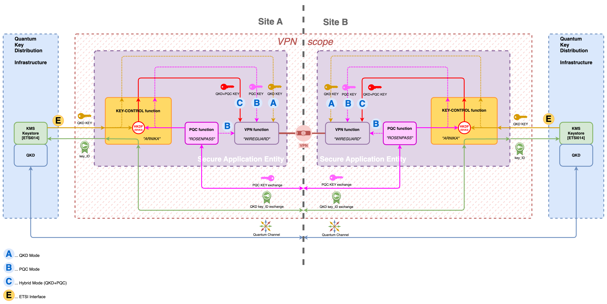

<!--
# Arnika - Quantum secure VPN

-->

<div style="text-align: center;">
    
</div>

<h1 style="text-align: center;"> Arnika - Quantum secure VPN</h1>

**Arnika** is a compact, **lightweight external extension for Wireguard VPN**, engineered to incorporate symmetric keys as Pre-Shared Keys (**PSK**) into Wireguard. This integration ensures the establishment of a quantum-secure VPN (safeguarding against compromise of session keys).

It gathers a 256-bit symmetric encryption key from a Key Management System (**KMS**) within a Quantum Key Distribution (**QKD**) infrastructure, shares the associated key ID with an Arnika peer, and configures an additional Pre-Shared Key (**PSK**) for Wireguard using the obtained key material.

Arnika offers an additional security layer for cryptography enthusiasts. It can integrate Post-Quantum Cryptography (**PQC**) by leveraging a PQC key provided by a system like **Rosenpass**. This key is then used to create an even stronger Preshared Key (PSK) for WireGuard. This PSK benefits from both **PQC** and **QKD**, offering enhanced protection against potential security threats.


Arnika integrates with WireGuard to establish quantum-resistant VPN connections, adding a significant layer of security to your communication

Arnika has been developed in scope of EU **EUROQCI** / **QCI-CAT** research program for the Use-Case **HSM BACKUP USING QKD** - https://qci-cat.at/hsm-backup-using-qkd

## Quantum secure VPN


<br/>_Figure 1_


<br/>_Figure 2_

## Wireguard + Rosenpass + Arnika

SAE (Secure Application Entity) = Wireguard + Rosenpass + Arnika

### QKD and PQC to achieve quantum resistance

The approach of combining symmetric keys from Quantum Key Distribution (QKD) and/or Post-Quantum Cryptography (PQC) with [WireGuard](https://www.wireguard.com/) as preshared key (PSK) has been used to enhance the security to achieve a post-quantum secure VPN.

### QKD | PQC key handling

The setup supports 3 operational modes, A, B, and C
* (A) ... QKD mode
* (B) ... PQC mode
* (C) ... QKD+PQC hyprid mode

Regardless of the selected mode, WireGuard always receives a single 256bit (32byte) key as PSK which is used for WireGuard internal `MixKeyAndHash()` using **HKDF**.

_Figure 3_ shows the key path of 2 interconnected sites for the hyprid mode (C) (QKD+PQC). In this scenario, the **KEY-CONTROL function** serves as a control entity, responsible for obtaining a **key** and transferring it to the encryption function (WireGuard).



<br/>_Figure 3_

The QKD key is obtained via ETSI014 from the QKDs embedded KMS and the PQC key is obtained via API or pointer/filedescriptor from a source such as **Rosenpass** or an alternative/already existing PQC function/implementation.


Subsequently, the **KEY-CONTROL function** uses the **QKD key** and **PQC key** by using a **HKDF HMAC Key Derivation Function** with SHA3-256 as the hash function, to derive a single key from the two input keys (QKD, PQC).
The specific derivation function, whether **HKDF** or an alternative, is a topic open for discussion among cryptographic experts.


# Advantages

QKD/PQC operation on **Layer 3** offers several notable advantages:

* Very low keyrate -> 1key per 120seconds (Rekey-After-Time, Rekey-After-Messages)
* PQC/QKD keys can be injected as preshared key at runtime by design
* no change in existing WireGuard setups
* L3 based VPN can go over any existing, affortable, foreign infrastructure over the internet
* Rosenpass (PQC) already implemented in netbird commercial VPN service [Netbird](https://netbird.io/) that supports mesh functionality
* unaffected by patent "Method of integrating QKD with IPSec" (US7602919B2,CN101142779A,...)


---

# Requirements

The `Secure Application Entity` consists of following components running on a secure and hardened linux system:
* Wireguard
* Rosenpass
* Arnika


# Limitations

[!IMPORTANT]
* `Arnika` is designed to provide a PSK directly to a local wireguard only.

---

# Start Dev Environment

## Start QKD KMS mock

```bash
go run tools/mock.go
```

now you can use the QKD KMS mock at http://127.0.0.1:8080

## Start Arnika #1

```bash
http_proxy=http://127.0.0.1:8080 no_proxy=127.0.0.1 LISTEN_ADDRESS=127.0.0.1:9999 SERVER_ADDRESS=127.0.0.1:9998 INTERVAL=1m KMS_URL="http://localhost:8080/api/v1/keys/CONSA" WIREGUARD_INTERFACE=qcicat0 WIREGUARD_PEER_PUBLIC_KEY="****************" build/arnika
```

## Start Arnika #2

```bash
http_proxy=http://127.0.0.1:8080 no_proxy=127.0.0.1 LISTEN_ADDRESS=127.0.0.1:9998 SERVER_ADDRESS=127.0.0.1:9999 INTERVAL=1m KMS_URL="https://QKDServer/api/v1/keys/CONSB" WIREGUARD_INTERFACE=qcicat0 WIREGUARD_PEER_PUBLIC_KEY="****************" build/arnika
```


# Build

```bash
make build
```

# Configuration

Arnika must be configured via environment variables, following are available:

| variable | description | example |
| --- | --- | --- |
| LISTEN_ADDRESS | address and port arnika listens on | 127.0.0.1:9998 |
| SERVER_ADDRESS | address and port arnika connects to | 127.0.0.1:9998 |
| CERTIFICATE | certificate file for cert authentication  | /etc/ssl/certs/arnika.crt |
| PRIVATE_KEY | private key file for cert authentication | /etc/ssl/private/arnika.key |
| CA_CERTIFICATE | CA certificate file for cert authentication | /etc/ssl/certs/ca-bundle.crt |
| KMS_URL | URL of QKD KMS | https://localhost:8080/api/v1/keys/CONSA |
| INTERVAL | interval between key requests to QKD KMS | 120s |
| WIREGUARD_INTERFACE | name of the WireGuard interface | qcicat0 |
| WIREGUARD_PEER_PUBLIC_KEY | public key of peer in WireGuard format | 8978940b-fb48-4ebf-ad7d-ca36a987fc32 |
| PQC_PSK_FILE | file containing PQC preshared key | /rosenpass/pqc.psk |

---


#  Credits

## Cancom Converged Services Gmbh (CCS)

**Arnika** was developed by
[Cancom Converged Services](https://www.cancom.at/en/industry-focus/provider) and the source code was released under [Apache-2.0]([LICENSE-2.0.txt](https://www.apache.org/licenses/LICENSE-2.0))


## WireGuard

[WireGuard](https://www.wireguard.com/) is an extremely simple fast and modern VPN that utilizes state-of-the-art cryptography.

[WireGuard](https://www.wireguard.com/) is designed as a general purpose VPN for running on embedded interfaces and super computers alike, fit for many different circumstances.

[WireGuard](https://www.wireguard.com/) uses state-of-the-art cryptography, like the Noise protocol framework, Curve25519, ChaCha20, Poly1305, BLAKE2, SipHash24, HKDF, and secure trusted constructions. It makes conservative and reasonable choices and has been reviewed by cryptographers.

[WireGuard](https://www.wireguard.com/) supports the use of an optional 256-bit (32-byte) preshared key (PSK) as an additional layer of security. The preshared key (PSK) is combined with the ephemeral keys generated during the initial handshake using the HKDF (HMAC-based Key Derivation Function). When a preshared key (PSK) is not used, the preshared key value used internally is an all-zero string of 32 bytes.


To ensure perfect forward secrecy (**PFS**) and minimizing the impact of key compromise [WireGuard](https://www.wireguard.com/) Rekeying timer is 120 seconds or 2^60 messages.

Refer to [WireGuard](https://www.wireguard.com/) Homepage [https://www.wireguard.com/protocol/] and Whitepaper [https://www.wireguard.com/papers/wireguard.pdf] for more technical details.

[WireGuard Source Code Repositories and Official Projects](https://www.wireguard.com/repositories/)


[WireGuard](https://www.wireguard.com/) is free and open-source software (FOSS) and licensed under GPLv2.

[WireGuard](https://www.wireguard.com/) and the [WireGuard](https://www.wireguard.com/) **logo** are registered trademarks of Jason A. Donenfeld.


## Rosenpass

The Rosenpass protocol provides a post-quantum-secure authenticated key exchange, based on the work Post-quantum WireGuard (PQWG) by Hülsing, Ning, Schwabe, Weber, and Zimmermann [https://eprint.iacr.org/2020/379], but also adds security against state disruption attacks CVE-2021-46873.

While Rosenpass is designed with WireGuard in mind, it can be used as a stand-alone tool to exchange keys. Using this mode, it can be employed to secure other protocols against attacks from quantum computers. Rosenpass will provide a Post-Quantum Cryptography (PQC) key every 120 seconds.

Rosenpass is using wo different Key Encapsulation Mechanisms (KEMs) Classic McEliece and Kyber

Refer to 10 – 12 Apr. 2024 Fifth NIST PQC workshop [https://classic.mceliece.org/talks/20240410.pdf]

Daniel J. Bernstein, Tung Chou, Carlos Cid, Jan Gilcher, Tanja Lange, Varun Maram, Ingo von Maurich, Rafael Misoczki, Ruben Niederhagen, Edoardo Persichetti, Christiane Peters, Nicolas Sendrier, Jakub Szefer, Cen Jung Tjhai, Martin Tomlinson, Wen Wang

Classic McEliece for long-term keys, the foundation of security for identifying and authenticating the server, as well as for encrypting data. Authenticity and Confidentiality

Kyber just for forward secrecy: a break of the lattice system does not damage security unless the attacker can also steal secret keys through, e.g., hardware theft.

Rosenpass was funded through NLnet with financial support from the European Commission’s NGI Assure program and ProtoType Fund of the Open Knowledge Foundation Germany, financed by the Federal Ministry of Education and Research (BMBF).

Refer to Rosenpass Homepage [https://rosenpass.eu/] and Whitepaper [https://rosenpass.eu/whitepaper.pdf] for more technical details.

Rosenpass is free and open-source software (FOSS) and licensed under Apache 2.0 license

Many thanks to [Karo](https://github.com/koraa) and [Paul](https://github.com/aparcar) from the [**Rosenpass**](https://github.com/rosenpass/rosenpass) project.


## QCI-CAT

Building on the long research experience of Austrian institutions in the field of quantum technologies, the project [QCI-CAT](https://qci-cat.at/) aims at an adoption of modern encryption technology based on QKD for highly secure communication between public authorities.

[QCI-CAT](https://qci-cat.at/) will investigate and verify new security applications for public authorities, such as secret sharing and message authentication.

Additionally, [QCI-CAT](https://qci-cat.at/) will also leverage a research testbed for new technological approaches such as the combination of post-quantum encryption with QKD, long-distance QKD with secured trusted nodes and field trials of quantum repeaters.

<br/>
This project has received funding from the [DIGITAL-2021-QCI-01 Digital European Program](https://ec.europa.eu/info/funding-tenders/opportunities/portal/screen/opportunities/topic-details/digital-2021-qci-01-deploy-national) under Project number No 101091642 and the [National Foundation for Research, Technology and Development](https://www.stiftung-fte.at/).


## AIT - Autrian Institute of Technology

[AIT Austrian Institute of Technology (AIT)](https://www.ait.ac.at/) is Austria’s largest research and technology organization.
The institute takes a leading position in the Austrian innovation system and a key role in Europe.
With its expertise of handling large EU quantum communication projects such as [OPENQKD](https://openqkd.eu/), [AIT](https://www.ait.ac.at/) will coordinate [QCI-CAT](https://qci-cat.at/) from an administrative point, as well as act as the technical manager and project lead.
