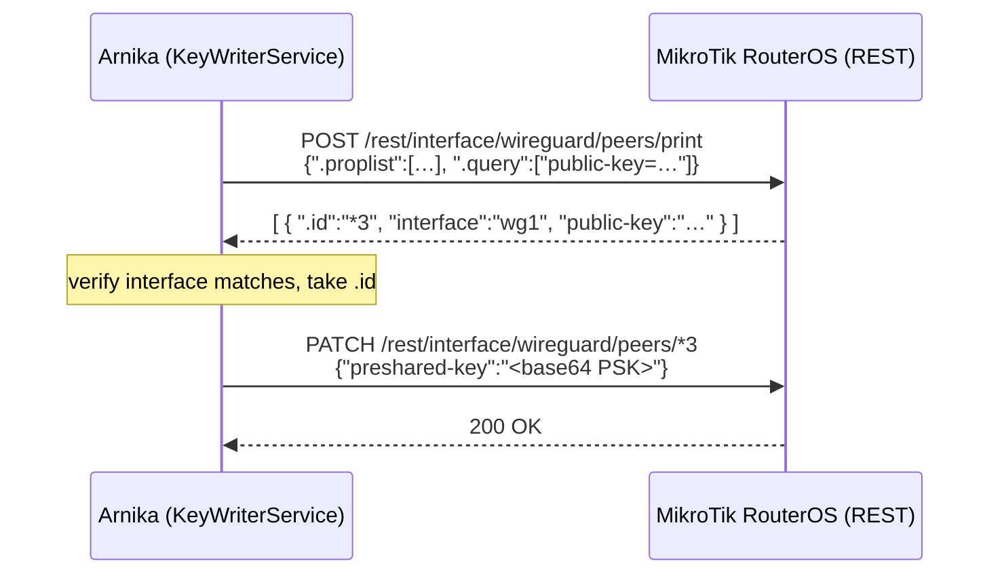

# wireguard-mikrotik

**Key writer module — provisions the WireGuard PSK onto a MikroTik RouterOS
device over its REST API.**

This is the single document for the `wireguard-mikrotik` module: how it is
built, how the router must be prepared, and how it is configured, compiled and
run. For the generic architecture that all key reader and key writer modules
follow, see [`KEYCONTROL.md`](../KEYCONTROL.md).

---

## Table of Contents

- [At a Glance](#at-a-glance)
- [How the Module Works](#how-the-module-works)
- [How the Module Is Constructed](#how-the-module-is-constructed)
- [Part 1 — Prepare the MikroTik Router](#part-1--prepare-the-mikrotik-router)
- [Part 2 — Configuration Reference](#part-2--configuration-reference)
- [Part 3 — Compile](#part-3--compile)
- [Part 4 — Run as a RouterOS Container](#part-4--run-as-a-routeros-container)
- [RouterOS REST API Reference](#routeros-rest-api-reference)
- [Testing the Module](#testing-the-module)
- [References](#references)

---

## At a Glance

| | |
| --- | --- |
| **Module name** | `wireguard-mikrotik` |
| **Kind** | Key writer (sink) |
| **Build tag** | `wireguard_mikrotik` |
| **Adapter** | [`repositories/wireguard-mikrotik.go`](../repositories/wireguard-mikrotik.go) |
| **Tests** | [`repositories/wireguard-mikrotik_test.go`](../repositories/wireguard-mikrotik_test.go) |
| **Wiring** | [`wireguardmikrotik.go`](../wireguardmikrotik.go) |
| **Target** | MikroTik RouterOS **v7+** with the WireGuard feature |
| **Transport** | HTTPS to the RouterOS REST API (`/rest`), HTTP Basic auth |
| **Dependencies** | Go standard library only |
| **Replaces** | The default [netlink writer](../repositories/wireguard-netlink.go), which configures a *local* WireGuard interface |

Use this module when the WireGuard tunnel terminates on a **MikroTik router**.
The deployment documented here runs Arnika **on the router**, as a container
that reaches the router's own REST API — see
[Part 4](#part-4--run-as-a-routeros-container).

---

## How the Module Works

Arnika's core (`setPSK` in [`main.go`](../main.go)) derives a 32-byte PSK,
base64-encodes it, and hands it to `KeyWriterService.SetPSK`. This module turns
that call into two REST requests.



Two behaviours define what the router side must support:

- **The peer is re-resolved on every rotation.** RouterOS internal ids (`*3`)
  are not stable across reboots or configuration changes, so the module never
  caches one.
- **`InvalidateTunnel` is the fail-safe.** When no valid key material is
  available, Arnika tears the tunnel down by writing a fresh random 32-byte PSK
  through the same code path. The peer stays configured; the session stops
  matching.

Arnika **only updates the `preshared-key` of an existing peer** — it never
creates the interface or the peer.

---

## How the Module Is Constructed

Two files, following the layout in
[`KEYCONTROL.md`](../KEYCONTROL.md#naming-and-file-layout-conventions).

### The adapter — `repositories/wireguard-mikrotik.go`

Implements the `keyWriterRepository` contract (`SetPSK`, `InvalidateTunnel`).
It carries **no build tag**, so it is compiled, vetted, linted and unit-tested
on every ordinary `go test ./...` run even though the default binary ships the
netlink writer.

Three design decisions shape it:

1. **The HTTP client is injected.** TLS trust, timeouts and proxy behaviour are
   configured once in the wiring file — which is also what lets the tests point
   the adapter at an `httptest.Server`.
2. **Peer lookup is server-side.** REST has no equivalent of the CLI's
   `[find public-key=…]`, so the module POSTs a `.query` to the `print` action
   rather than downloading the whole peers table. A `.proplist` restricts the
   response to `.id`, `interface` and `public-key`, so no sensitive field ever
   crosses the wire.
3. **The interface is verified after the query.** `.query` filters on the public
   key alone; the module then checks `interface`, guarding against the same key
   appearing on two interfaces.

Non-2xx responses become errors carrying the method, path, status and the first
512 bytes of the RouterOS error body.

### The wiring — `wireguardmikrotik.go`

Guarded by `//go:build wireguard_mikrotik`. It is the *only* place this
backend's environment variables are read, which keeps the shared
`config.Config` transport-agnostic. It builds an `*http.Client` with
`MinVersion: tls.VersionTLS12`, constructs the repository, and wraps it in a
`KeyWriterService`. Every mandatory setting is validated at startup, so a
misconfiguration fails immediately rather than at the first rotation.

Because this file defines `getKeyWriterService`, and
[`wireguardnetlink.go`](../wireguardnetlink.go) defines the same symbol under
`//go:build wireguard_netlink || !wireguard_mikrotik`, exactly one writer is
ever compiled — and asking for both tags is a compile error, not a silent
choice.

---

## Part 1 — Prepare the MikroTik Router

All commands run **on the router** (SSH, WinBox terminal or console) in
RouterOS syntax.

> RouterOS is not Linux — `ssh admin@router` opens the RouterOS CLI, not a
> shell.

Placeholders:

| Placeholder | Meaning | Example |
| --- | --- | --- |
| `<ROUTER_IP>` | Address Arnika reaches the router on — must be in the certificate SAN | `100.102.202.1` |
| `<PEER_PUBKEY>` | Public key of the **remote** WireGuard peer | `uUD5lB2Ze5oi…=` |
| `<ARNIKA_SOURCE_IP>` | Address Arnika connects from — its container veth IP | `100.102.204.22` |
| `<ARNIKA_PASSWORD>` | Password for the dedicated RouterOS user created in Step 5 | — |
| `<container-store>` | Container storage path on the router | `usb1-part1` |

### Step 1 — WireGuard interface and peer

Arnika updates an existing peer. If your tunnel is already up, skip ahead.

```routeros
/interface/wireguard/add name=wg1 listen-port=13231 mtu=1440
/interface/wireguard/peers/add interface=wg1 name=peer1 \
    public-key="<PEER_PUBKEY>" allowed-address=0.0.0.0/0
/interface/wireguard/peers/print
```

> Arnika matches on the pair (`public-key`, `interface`). `WIREGUARD_INTERFACE`
> must equal the RouterOS interface name, and `WIREGUARD_PEER_PUBLIC_KEY` the
> `public-key` field of this peer — exact base64, including the trailing `=`.

### Step 2 — Certificates for the REST API

RouterOS ships without a usable `www-ssl` certificate, so create a local CA and
a server certificate.

> ⚠️ **The certificate needs a Subject Alternative Name.** Arnika is a Go
> program, and Go does **not** fall back to Common Name for hostname
> verification. Set `subject-alt-name` to exactly what goes in `MIKROTIK_URL` —
> `IP:` for an address, `DNS:` for a hostname. Without it you get
> `x509: certificate relies on legacy Common Name field, use SANs instead`, or
> `x509: cannot validate certificate for <ip> because it doesn't contain any IP SANs`.

```routeros
/certificate/add name=ca-template common-name=api-ca \
    key-usage=key-cert-sign,crl-sign days-valid=3650 key-size=2048
/certificate/sign ca-template

/certificate/add name=api-cert common-name=<ROUTER_IP> \
    subject-alt-name=IP:<ROUTER_IP> \
    key-usage=digital-signature,key-encipherment,tls-server \
    days-valid=3650 key-size=2048
/certificate/sign api-cert ca=ca-template

/certificate/print    # wait for the K (private key) and T (trusted) flags
```

`digital-signature,key-encipherment,tls-server` is a deliberate superset of
`tls-server`: it satisfies both the extended-key-usage and key-usage checks TLS
clients apply to an RSA server certificate.

### Step 3 — Enable REST on `www-ssl`

> ⚠️ **Use `www-ssl`, not `api-ssl`.** `api-ssl` (8729) is the legacy binary API
> and serves no REST endpoints at all.

```routeros
/ip/service/set www-ssl certificate=api-cert disabled=no

# close everything Arnika does not need
/ip/service/set www disabled=yes
/ip/service/set api disabled=yes
/ip/service/set api-ssl disabled=yes

# restrict the source
/ip/service/set www-ssl address=<ARNIKA_SOURCE_IP>/32
/ip/service/print
```

### Step 4 — Export the CA for Arnika

```routeros
/certificate/export-certificate ca-template export-passphrase=""
/file/print                       # cert_export_ca-template.crt
```

An empty passphrase exports the **certificate only** — no private key. Download
it with an account holding the `ftp` policy (`admin` does; the restricted user
below deliberately does not), or via WinBox **Files**:

```bash
scp admin@<ROUTER_IP>:cert_export_ca-template.crt ./api-ca.crt
```

### Step 5 — A restricted user for Arnika

Do **not** use `admin`. Arnika needs to log in over REST, read the peers table,
and write one property.

```routeros
/user/group/add name=arnika-writer policy=read,write,sensitive,api,rest-api \
    comment="Arnika PSK writer"

/user/add name=arnika group=arnika-writer password="<ARNIKA_PASSWORD>" \
    address=<ARNIKA_SOURCE_IP>/32
```

> ⚠️ **`api` *and* `rest-api` are both required** — they are not alternatives.
> With only `rest-api` every call returns `500 std failure: not allowed (9)`;
> with only `api`, `401`. `rest-api` grants access to the REST interface, `api`
> grants permission to run the commands behind it. The `api` *policy* is
> unrelated to the `api` *service* disabled in Step 3.

| Policy | Why |
| --- | --- |
| `rest-api` | Access to `/rest` at all |
| `api` | Permission to execute the commands behind it |
| `read` | The `peers/print` lookup |
| `write` | The `PATCH` that sets `preshared-key` |
| `sensitive` | `preshared-key` is a sensitive property |

Withheld: `policy`, `ssh`, `local`, `telnet`, `winbox`, `ftp`, `reboot` — the
account is usable only over REST.

> ⚠️ RouterOS **caches an authenticated `www-ssl` session**, so editing a group
> does not change an already-open session. Test policy changes with a *fresh*
> user, or you measure the old rights.

### Step 6 — Verify before involving Arnika

Confirm TLS trust, authentication and write permission by hand.

```bash
# TLS chain and hostname — expect "Verify return code: 0 (ok)"
openssl s_client -connect <ROUTER_IP>:443 -CAfile api-ca.crt \
    -verify_hostname <ROUTER_IP> </dev/null

# the exact lookup Arnika makes — expect one element carrying .id
curl --cacert api-ca.crt -u arnika:'<ARNIKA_PASSWORD>' \
  -X POST "https://<ROUTER_IP>/rest/interface/wireguard/peers/print" \
  -H "Content-Type: application/json" \
  --data '{".proplist":[".id","interface","public-key"],".query":["public-key=<PEER_PUBKEY>"]}'

# the exact update Arnika makes — expect 200 and the updated peer
curl --cacert api-ca.crt -u arnika:'<ARNIKA_PASSWORD>' \
  -X PATCH "https://<ROUTER_IP>/rest/interface/wireguard/peers/*1" \
  -H "Content-Type: application/json" \
  --data '{"preshared-key":"KH8nrvx0cuczwE3R56qH5/vyLyHAEBv0QwogCA50ZjU="}'
```

An empty array `[]` from the lookup means the public key matches no peer —
compare it character-for-character against
`/interface/wireguard/peers/print`. If you need `-k` here, Arnika will need
`MIKROTIK_TLS_INSECURE=true`, which is lab-only.

---

## Part 2 — Configuration Reference

MikroTik settings are read from the environment **only** in the
`wireguard_mikrotik` build. The peer is identified with the shared
`WIREGUARD_*` values — which here name an interface and peer **on the router**.

| Env var | Required | Default | Description |
| --- | :---: | --- | --- |
| `MIKROTIK_URL` | ✅ | — | Base URL, e.g. `https://100.102.202.1`. **No trailing `/rest`.** Must match the certificate SAN |
| `MIKROTIK_USERNAME` | ✅ | — | The `arnika` user from [Step 5](#step-5--a-restricted-user-for-arnika) |
| `MIKROTIK_PASSWORD` | ✅ | — | Password for that user |
| `MIKROTIK_CA_CERTIFICATE` | ➖ | *(system roots)* | PEM CA from [Step 4](#step-4--export-the-ca-for-arnika). **Effectively mandatory in a container** — a `FROM scratch` image has no system roots to fall back to |
| `MIKROTIK_TLS_INSECURE` | ➖ | `false` | Disables verification — **lab only** |
| `MIKROTIK_HTTP_TIMEOUT` | ➖ | `10s` | Go duration string |
| `WIREGUARD_INTERFACE` | ✅ | — | Interface name **on the router** |
| `WIREGUARD_PEER_PUBLIC_KEY` | ✅ | — | `public-key` of the peer whose PSK is rotated |

`MIKROTIK_CA_CERTIFICATE` and `MIKROTIK_TLS_INSECURE` are mutually exclusive in
effect: with `MIKROTIK_TLS_INSECURE=true` the CA file is not consulted. TLS 1.2
is the enforced minimum either way.

The usual Arnika settings (`KMS_URL`, `CERTIFICATE`, `PRIVATE_KEY`,
`CA_CERTIFICATE`, `LISTEN_ADDRESS`, `SERVER_ADDRESS`, `ARNIKA_ID`, `INTERVAL`,
`MODE`, `PQC_ENABLED`, …) apply unchanged — see [`INSTALL.md`](../INSTALL.md).
[Part 4, Step 4](#step-4--environment-and-certificate-mount) shows a complete
working set in RouterOS form.

`MIKROTIK_PASSWORD` is a RouterOS credential and is visible to anyone who can
read `/container/envs/print` — keep the account restricted as in Step 5.

---

## Part 3 — Compile

The writer backend is selected at **compile time**. A default build ships the
netlink writer and ignores every `MIKROTIK_*` variable, so the tag is not
optional.

> **`GOEXPERIMENT=runtimesecret` is mandatory for every `go` command** —
> `build`, `test` and `vet` alike. Without it the build fails with
> `build constraints exclude all Go files in .../runtime/secret`. The
> `Makefile` sets it for you.

```bash
# local platform
GOEXPERIMENT=runtimesecret go build -tags wireguard_mikrotik -o arnika-mikrotik .

# release flags, cross-compiled — set GOOS/GOARCH for the target
CGO_ENABLED=0 GOEXPERIMENT=runtimesecret GOOS=linux GOARCH=arm64 \
go build -tags wireguard_mikrotik -trimpath \
  -ldflags "-w -s -X 'main.Version=$(git describe --tags --always)' -X 'main.APPName=arnika'" \
  -o build/arnika-linux-arm64-mikrotik .
```

The build is pure Go (`CGO_ENABLED=0`), so no cross C-toolchain is needed.
Match `GOARCH` to the router: `arm64` for CCR2004 / RB5009, `arm` (`GOARM=7`)
for older 32-bit ARM boards, `amd64` for CHR.

Via the [`Makefile`](../Makefile), which passes tags through `BUILD_TAGS`:

```bash
make build BUILD_TAGS=wireguard_mikrotik           # generic form
make build-mikrotik                                 # convenience target
GOOS=linux GOARCH=arm64 make build-mikrotik         # cross-compiled
```

### Verify the right writer was compiled in

`go test ./...` and `golangci-lint` run against the **default (netlink)** build,
so they do not cover [`wireguardmikrotik.go`](../wireguardmikrotik.go):

```bash
GOEXPERIMENT=runtimesecret go vet -tags wireguard_mikrotik ./...
go version -m build/arnika-linux-arm64-mikrotik | grep "build\s\+-tags"
# build -tags=wireguard_mikrotik
```

Requesting both writers is a deliberate compile error — this **must** fail:

```bash
GOEXPERIMENT=runtimesecret go build -tags "wireguard_netlink wireguard_mikrotik" .
# ./wireguardnetlink.go:11:6: getKeyWriterService redeclared in this block
```

---

## Part 4 — Run as a RouterOS Container

Arnika runs on the router itself and reaches the router's own REST API, so the
whole key writer path stays on the device.

### Prerequisites

The container platform must already be set up — enabling device-mode requires
physical confirmation at the router, and the `container` package must match the
RouterOS version and architecture. Confirm rather than assume:

```routeros
/system/device-mode/print     # container: yes
/system/package/print         # container present, no X flag
/container/config/print       # layer-dir and tmpdir point at container storage
/container/print              # menu resolves = engine up
```

### Step 1 — Build the image

`FROM scratch` around the single static binary from
[Part 3](#part-3--compile). It needs no writable filesystem and no DNS.

```dockerfile
FROM scratch
COPY arnika-linux-arm64-mikrotik /arnika
ENTRYPOINT ["/arnika"]
```

> ⚠️ **`ENTRYPOINT` must be `["/arnika"]`.** Copy-pasted from a sibling image
> (e.g. `["/kms"]`) the container starts and exits immediately with *no such
> file or directory* — nothing else exists in the image.

Confirm the binary is really the MikroTik build, then build a
**docker-archive**:

```sh
strings -a arnika-linux-arm64-mikrotik | grep -oE "arnika/repositories\.[A-Za-z]+" | sort -u
# expect NewWireguardMikrotikRepository — and NO WireguardNetlinkRepository

docker buildx build --platform linux/arm64 --provenance=false --sbom=false \
    -t arnika:2.0.0a -o type=docker,dest=arnika.tar .

tar tf arnika.tar | grep -qx manifest.json && echo "OK docker-archive"
```

> ⚠️ **Not `docker save`.** On a BuildKit/containerd daemon it emits an OCI
> archive with an attestation manifest and a nested multi-arch index, which
> RouterOS's importer can reject. The flags above force a single-arch
> docker-archive with `manifest.json` at the root.

### Step 2 — Upload the image and certificates

```sh
sftp <ROUTER_IP> <<'EOF'
put arnika.tar <container-store>/arnika.tar
-mkdir <container-store>/arnika
put api-ca.crt     <container-store>/arnika/api-ca.crt
put kms-ca.crt     <container-store>/arnika/kms-ca.crt
put client.crt     <container-store>/arnika/client.crt
put client.key     <container-store>/arnika/client.key
EOF
```

| File | Purpose | Env var |
| --- | --- | --- |
| `api-ca.crt` | Verifies **this router's** `www-ssl` certificate ([Step 4](#step-4--export-the-ca-for-arnika)) | `MIKROTIK_CA_CERTIFICATE` |
| `kms-ca.crt` | Verifies the **KMS / QKD** endpoint | `CA_CERTIFICATE` |
| `client.crt` / `client.key` | Arnika's client certificate for mTLS **to the KMS** | `CERTIFICATE` / `PRIVATE_KEY` |

> ⚠️ These are **two separate trust domains** — one authenticates the router's
> management endpoint, the other the key source. Do not merge them.

### Step 3 — Give the container an address

```routeros
/interface/veth/add name=veth-arnika address=<ARNIKA_SOURCE_IP>/24 \
    gateway=<VLAN_GW> comment="Arnika - WireGuard PSK provisioner"

/interface/bridge/port/add bridge=bridge interface=veth-arnika pvid=<VLAN_ID>

# re-state the FULL untagged list — `set untagged=` REPLACES, it does not append
/interface/bridge/vlan/set [find vlan-ids=<VLAN_ID>] \
    untagged=ether5,ether6,ether7,ether8,veth-arnika
```

A veth shows `I` (inactive) until a container runs on it — expected.

> ⚠️ If the container sits on a different VLAN from the management address it
> reaches it by inter-VLAN routing, which is fine — but the address in
> `MIKROTIK_URL` must be the one in the certificate SAN.

### Step 4 — Environment and certificate mount

> ⚠️ **Syntax:** `/container/envs` and `/container/mounts` are keyed by
> **`list=`**, not `name=`; `/container/add` references them with the **plural**
> `envlists=` / `mountlists=`.

```routeros
/container/mounts/add list=arnikacert src=<container-store>/arnika dst=/arnika-certs

# --- MikroTik key writer (this module) ---
/container/envs/add list=arnikaenv key=MIKROTIK_URL            value="https://100.102.202.1"
/container/envs/add list=arnikaenv key=MIKROTIK_USERNAME       value="arnika"
/container/envs/add list=arnikaenv key=MIKROTIK_PASSWORD       value="<ARNIKA_PASSWORD>"
/container/envs/add list=arnikaenv key=MIKROTIK_CA_CERTIFICATE value="/arnika-certs/api-ca.crt"

# --- peer identification, on this router ---
/container/envs/add list=arnikaenv key=WIREGUARD_INTERFACE       value="wg1"
/container/envs/add list=arnikaenv key=WIREGUARD_PEER_PUBLIC_KEY value="<PEER_PUBKEY>"

# --- key source (KMS / QKD) ---
/container/envs/add list=arnikaenv key=KMS_URL        value="https://<KMS_HOST>:8443/api/v1/keys/<PEER_SAE_ID>"
/container/envs/add list=arnikaenv key=CA_CERTIFICATE value="/arnika-certs/kms-ca.crt"
/container/envs/add list=arnikaenv key=CERTIFICATE    value="/arnika-certs/client.crt"
/container/envs/add list=arnikaenv key=PRIVATE_KEY    value="/arnika-certs/client.key"

# --- peer coordination and rotation ---
/container/envs/add list=arnikaenv key=LISTEN_ADDRESS value="0.0.0.0:9000"
/container/envs/add list=arnikaenv key=SERVER_ADDRESS value="<PEER_ARNIKA_IP>:9000"
/container/envs/add list=arnikaenv key=ARNIKA_ID      value="2"
/container/envs/add list=arnikaenv key=INTERVAL       value="60s"
/container/envs/add list=arnikaenv key=MODE           value="AtLeastQkdRequired"

/container/envs/print where list="arnikaenv"
```

Every certificate value is a path **inside** the container, under the
`/arnika-certs` mount point — not a path in the router's file store.

When two Arnika instances form a pair, these differ per node:

| Env var | Meaning |
| --- | --- |
| `SERVER_ADDRESS` | The **peer** Arnika's `LISTEN_ADDRESS` |
| `ARNIKA_ID` | Decides which side is PRIMARY for a given interval. Set it explicitly on both nodes, and give the two values **different parity** — one odd, one even. Only the lowest bit is used, so two odd or two even IDs make both nodes pick the same role in every interval |
| `WIREGUARD_PEER_PUBLIC_KEY` | The **other** router's public key |
| `MIKROTIK_URL` | Each node points at its **own** router |

And these must be **identical** on both nodes:

| Env var | Meaning |
| --- | --- |
| `ARNIKA_PSK` | Shared secret authenticating and encrypting the peer channel. Must be set — with it unset the channel keys derive from the empty string and provide no protection |
| `INTERVAL` | Roles are elected per interval number, so differing intervals drift the two nodes apart |
| `MODE` | Both sides must agree on which key sources are mandatory |

### Step 5 — Create and start

```routeros
/container/add file=<container-store>/arnika.tar name=arnika interface=veth-arnika \
    root-dir=<container-store>/arnika-root \
    envlists=arnikaenv mountlists=arnikacert \
    logging=yes start-on-boot=yes

/container/print                       # wait for S (stopped) = extraction finished
/container/start [find name="arnika"]
/container/print                       # R (running)
```

> ⚠️ **`root-dir=…/arnika-root`, not `…/arnika`** — that second path is the
> mounted certificate bundle from Step 2.
>
> ⚠️ **Quote hyphenated names in `[find]`.** `[find name=my-container]` parses
> as the *expression* `my` minus `container`, matches the wrong row or none,
> and yields the misleading `failure: not stopped`.

`start-on-boot=yes` is what makes the deployment survive a reboot.

### Step 6 — Confirm the PSK is rotating

`logging=yes` sends the container's stdout to the RouterOS log:

```routeros
/container/print detail
/log/print where topics~"container"
```

```text
arnika: [INFO] PRIMARY[2] [OK] PSK configured on WireGuard interface: wg1 for peer: uUD5lB2Ze5oi…=
```

The PSK must be present and 44 characters — base64 of 32 bytes:

```routeros
:put [:len [/interface/wireguard/peers/get [find name="peer1"] preshared-key]]    # 44
```

Both ends must hold the **same** PSK. Compare digests rather than printing the
secret:

```sh
for r in <router-a>:<peer-name-a> <router-b>:<peer-name-b>; do
  ssh ${r%%:*} ":put [/interface/wireguard/peers/get [find name=\"${r##*:}\"] preshared-key]" \
    | tail -1 | tr -d '\r\n' | shasum -a256 | cut -c1-12
done      # the two digests must match
```

A rotation that lands on both ends keeps traffic flowing; one that lands on
only one end stops it — which is what `InvalidateTunnel` is designed to do when
no valid key material is available.

---

## RouterOS REST API Reference

The endpoints this module uses, and the hand-run equivalents for debugging.

### Verb mapping

| HTTP | RouterOS action | CLI equivalent |
| --- | --- | --- |
| `GET` | print (list/read) | `/path/print` |
| `PUT` | **add (create)** | `/path/add` |
| `PATCH` | set (update) | `/path/set` |
| `DELETE` | remove | `/path/remove` |
| `POST` | run a command | `/path/<command>` |

`PUT` creates rather than updates — the opposite of the common convention. This
module uses only `POST …/print` and `PATCH …/<id>`.

### Which service serves REST

| Service | Port | Serves REST? |
| --- | --- | --- |
| `www` | 80 | Yes — plaintext, do not use |
| `www-ssl` | 443 | **Yes — use this** |
| `api` | 8728 | No — legacy binary API |
| `api-ssl` | 8729 | No — legacy binary API over TLS |

### Find a peer by public key

REST has **no `find` abstraction**. Two options exist:

```bash
# query parameters — simple, but returns all properties and needs the
# base64 key URL-encoded (it contains + and /)
curl --cacert api-ca.crt -u arnika:'<ARNIKA_PASSWORD>' \
  -X GET "https://<ROUTER_IP>/rest/interface/wireguard/peers?public-key=<PEER_PUBKEY>"

# a server-side .query on print — what this module does
curl --cacert api-ca.crt -u arnika:'<ARNIKA_PASSWORD>' \
  -X POST "https://<ROUTER_IP>/rest/interface/wireguard/peers/print" \
  -H "Content-Type: application/json" \
  --data '{".proplist":[".id","interface","public-key"],".query":["public-key=<PEER_PUBKEY>"]}'
```

```json
[{".id":"*1","interface":"wg1","public-key":"uUD5lB2Ze5oiCZDvBG9AA+COlctFF/E/tN/oOsBUHCk="}]
```

The key travels in a JSON body (no URL encoding), the filter runs on the
router, and `.proplist` keeps sensitive fields out of the response.

> **Always send a `.proplist`.** Without it RouterOS returns every property,
> including `private-key` and `preshared-key`.

### Set the preshared key

```bash
curl --cacert api-ca.crt -u arnika:'<ARNIKA_PASSWORD>' \
  -X PATCH "https://<ROUTER_IP>/rest/interface/wireguard/peers/*1" \
  -H "Content-Type: application/json" \
  --data '{"preshared-key":"KH8nrvx0cuczwE3R56qH5/vyLyHAEBv0QwogCA50ZjU="}'
```

RouterOS answers `200` with the updated peer object. The `.id` in the URL must
be the internal id, which is why the module resolves it first. The CLI
equivalent, for a manual check on the router:

```routeros
/interface/wireguard/peers/set [find public-key="<PEER_PUBKEY>"] \
    preshared-key="KH8nrvx0cuczwE3R56qH5/vyLyHAEBv0QwogCA50ZjU="
```

### Error shape

Failures come back as a JSON object, not an array:

```json
{"error":400,"message":"Bad Request","detail":"no such item"}
```

The module surfaces the status line plus the first 512 bytes of this body in
the Arnika log.

---

## Testing the Module

The adapter carries no build tag, so its tests run in the ordinary suite:

```bash
GOEXPERIMENT=runtimesecret go test ./repositories/ -run TestWireguardMikrotik -v
```

[`repositories/wireguard-mikrotik_test.go`](../repositories/wireguard-mikrotik_test.go)
stands up an `httptest.Server` impersonating the RouterOS peers collection:

| Test | What it pins down |
| --- | --- |
| `…_SetPSK` | Basic auth is sent; the id is resolved with a server-side `.query` (exactly one `print`); a single `PATCH` targets the right `.id` with the right PSK |
| `…_SetPSK_PeerNotFound` | A missing peer is an error, and **no** `PATCH` is attempted |
| `…_InvalidateTunnel` | The written PSK is valid base64 of exactly 32 bytes, and differs between calls |

The tagged wiring file is not covered — check it with
`GOEXPERIMENT=runtimesecret go vet -tags wireguard_mikrotik ./...`.

---

## References

- Module architecture and how to add another writer: [`KEYCONTROL.md`](../KEYCONTROL.md)
- Key exchange protocol flow: [`CODEFLOW.md`](../CODEFLOW.md)
- Deployment of the surrounding stack: [`INSTALL.md`](../INSTALL.md)
- Security model: [`SECURITY.md`](../SECURITY.md)
- RouterOS REST API: <https://help.mikrotik.com/docs/display/ROS/REST+API>
- RouterOS WireGuard: <https://help.mikrotik.com/docs/display/ROS/WireGuard>
- RouterOS certificates: <https://help.mikrotik.com/docs/display/ROS/Certificates>
- RouterOS user policies: <https://help.mikrotik.com/docs/display/ROS/User>
- RouterOS containers: <https://help.mikrotik.com/docs/display/ROS/Container>
