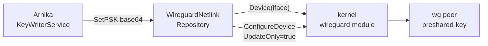

# wireguard-netlink

**Key writer module — installs the WireGuard PSK into a local WireGuard
interface through the kernel's netlink API.**

This is the single document for the `wireguard-netlink` module: how it is
built, what the host must provide, and how it is configured, compiled and run.
It is Arnika's **default** key writer — you get it unless you explicitly build
another. For the generic architecture all key reader and key writer modules
follow, see [`KEYCONTROL.md`](../KEYCONTROL.md).

---

## Table of Contents

- [At a Glance](#at-a-glance)
- [How the Module Works](#how-the-module-works)
- [How the Module Is Constructed](#how-the-module-is-constructed)
- [Part 1 — Prepare the Host](#part-1--prepare-the-host)
- [Part 2 — Configuration Reference](#part-2--configuration-reference)
- [Part 3 — Compile](#part-3--compile)
- [Part 4 — Run](#part-4--run)
- [Testing the Module](#testing-the-module)
- [References](#references)

---

## At a Glance

| | |
| --- | --- |
| **Module name** | `wireguard-netlink` |
| **Kind** | Key writer (sink) |
| **Build tag** | _(default)_ — or `wireguard_netlink` explicitly |
| **Adapter** | [`repositories/wgnetlink/netlink.go`](../repositories/wgnetlink/netlink.go) |
| **Tests** | _none_ — see [Testing the Module](#testing-the-module) |
| **Wiring** | [`wire_wireguard_netlink.go`](../wire_wireguard_netlink.go) |
| **Target** | A **local** WireGuard interface on the same host as Arnika |
| **Transport** | `wgctrl` over netlink (no network I/O) |
| **Dependencies** | `golang.zx2c4.com/wireguard/wgctrl` |
| **Privileges** | `CAP_NET_ADMIN` — it reconfigures a network device |
| **Alternative** | [`wireguard-mikrotik`](wireguard-mikrotik.md), which writes to a _remote_ MikroTik router over REST |

Use this module when the WireGuard tunnel terminates **on the same host** that
runs Arnika — the classic deployment described in
[`INSTALL.md`](../INSTALL.md).

---

## How the Module Works

Arnika's core (`setPSK` in [`main.go`](../main.go)) derives a 32-byte PSK,
base64-encodes it, and hands it to `KeyWriterService.SetPSK`. This module turns
that call into a local netlink transaction — no sockets, no remote party, no
TLS.



Each `SetPSK` call:

1. Reads the device with `conn.Device(interfaceName)` — this is also what
   proves the interface exists.
2. Scans the device's peers for the configured public key, reporting absence
   only after the whole list has been checked.
3. Parses both the PSK and the peer public key into `wgtypes.Key` values,
   which enforces "32 bytes, base64".
4. Calls `ConfigureDevice` with a single `PeerConfig` carrying
   **`UpdateOnly: true`** and the new `PresharedKey`.

`UpdateOnly: true` is the important flag: it means Arnika will **modify an
existing peer only** and never create one. A peer that is not already
configured is silently left alone rather than added.

`InvalidateTunnel` — the fail-safe used when no valid key material is available
— generates a fresh key with `wgtypes.GenerateKey()` and installs it through
the same path, so the session stops matching and traffic stops.

---

## How the Module Is Constructed

Two files, following the layout in
[`KEYCONTROL.md`](../KEYCONTROL.md#naming-and-file-layout-conventions).

### The adapter — `repositories/wgnetlink/netlink.go`

Implements the `keyWriterRepository` contract (`SetPSK`, `InvalidateTunnel`).
It carries **no build tag**, so it compiles and lints on every build regardless
of which writer the binary ships.

```go
type WireguardNetlinkRepository struct {
    InterfaceName string
    PeerPublicKey string
    conn          *wgctrl.Client
}
```

Two points distinguish it from the MikroTik adapter:

1. **The client is created in the constructor, not injected.**
   `NewWireguardNetlinkRepository` calls `wgctrl.New()` itself and returns an
   error if the netlink connection cannot be opened. There is no transport to
   configure — no TLS, no timeouts, no credentials — so there is nothing for a
   caller to supply. This is also why the constructor returns `(repo, error)`
   while the MikroTik one cannot fail.
2. **Key material is handled as `wgtypes.Key`.** `wgtypes.ParseKey` rejects
   anything that is not 32 bytes of valid base64, so malformed PSKs fail before
   reaching the kernel.

### The wiring — `wire_wireguard_netlink.go`

```go
//go:build wireguard_netlink || !wireguard_mikrotik
```

That constraint is what makes netlink the **default**: the file is included
unless `wireguard_mikrotik` is requested, and also when `wireguard_netlink` is
named explicitly. The wiring itself is minimal — it reads nothing from the
environment beyond the shared config, because this module has no
backend-specific settings.

Because both this file and
[`wire_wireguard_mikrotik.go`](../wire_wireguard_mikrotik.go) define
`getKeyWriterService`, asking for both tags at once is a compile error rather
than a silent choice.

> When adding a third writer, its tag must be added to the negated clause here
> — `!wireguard_mikrotik && !wireguard_yours` — or the default will collide
> with it. See [`KEYCONTROL.md`](../KEYCONTROL.md#adding-a-new-key-writer).

---

## Part 1 — Prepare the Host

Arnika **updates the PSK of an existing peer**. The interface and the peer must
already exist and be up before Arnika starts.

### Step 1 — WireGuard kernel support

```bash
sudo apt install -y wireguard wireguard-tools    # Debian/Ubuntu
modinfo wireguard | head -2                       # or: lsmod | grep wireguard
```

WireGuard is in-tree since Linux 5.6. On older kernels the DKMS module from
`wireguard-dkms` works equally well.

> `wgctrl` also speaks the userspace UAPI socket used by `wireguard-go`, so a
> userspace interface works too — but the kernel module is the intended target
> and the only one covered here.

### Step 2 — The interface and peer

A minimal `/etc/wireguard/<iface>.conf`; see [`INSTALL.md`](../INSTALL.md) for
the full two-host setup with addressing and `AllowedIPs`.

```ini
[Interface]
Address = 10.127.254.9/30
ListenPort = 44222
PrivateKey = <LOCAL_PRIVATE_KEY>

[Peer]
PublicKey = <PEER_PUBLIC_KEY>
PresharedKey = <ANY_VALID_PSK>
AllowedIPs = 10.127.254.10/32
Endpoint = <PEER_IP>:53991
```

```bash
sudo chmod 600 /etc/wireguard/qcicat0.conf
sudo systemctl enable --now wg-quick@qcicat0
```

The `PresharedKey` in the file is only a placeholder to bring the tunnel up —
Arnika overwrites it on the first rotation. Generate one with `wg genpsk`.

Confirm what Arnika will look for:

```bash
sudo wg show qcicat0
```

`WIREGUARD_INTERFACE` must equal the interface name, and
`WIREGUARD_PEER_PUBLIC_KEY` the peer's `public key` field exactly — base64,
including the trailing `=`.

### Step 3 — Privileges

Reconfiguring a network device requires **`CAP_NET_ADMIN`**. Running as `root`
satisfies this; [Part 4](#part-4--run) also shows an unprivileged unit that
grants only that one capability.

---

## Part 2 — Configuration Reference

This module has **no settings of its own**. It uses only the shared WireGuard
values, which here name a local interface and peer:

| Env var | Required | Description |
| --- | :---: | --- |
| `WIREGUARD_INTERFACE` | ✅ | Name of the local WireGuard interface, e.g. `qcicat0` |
| `WIREGUARD_PEER_PUBLIC_KEY` | ✅ | `public key` of the peer whose PSK is rotated |

Both are read by [`config/config.go`](../config/config.go) and are mandatory in
every build — there is no netlink-specific block to configure, and no
`MIKROTIK_*`-style variables apply.

The usual Arnika settings (`KMS_URL`, `CERTIFICATE`, `PRIVATE_KEY`,
`CA_CERTIFICATE`, `LISTEN_ADDRESS`, `SERVER_ADDRESS`, `ARNIKA_ID`, `INTERVAL`,
`MODE`, `PQC_ENABLED`, …) apply unchanged — see [`INSTALL.md`](../INSTALL.md).

---

## Part 3 — Compile

This is the default backend, so no tag is needed. Both forms below are
equivalent:

> **`GOEXPERIMENT=runtimesecret` is mandatory for every `go` command** —
> `build`, `test` and `vet` alike. Without it the build fails with
> `build constraints exclude all Go files in .../runtime/secret`. The
> `Makefile` sets it for you.

```bash
GOEXPERIMENT=runtimesecret go build .                            # default
GOEXPERIMENT=runtimesecret go build -tags wireguard_netlink .    # explicit
```

Release flags, matching the [`Makefile`](../Makefile):

```bash
CGO_ENABLED=0 GOEXPERIMENT=runtimesecret GOOS=linux GOARCH=amd64 \
go build -trimpath \
  -ldflags "-w -s -X 'main.Version=$(git describe --tags --always)' -X 'main.APPName=arnika'" \
  -o build/arnika-linux-amd64 .
```

Via the Makefile:

```bash
make                     # netlink (default)
make build-netlink       # netlink (explicit)
```

The build is pure Go (`CGO_ENABLED=0`), so `GOOS`/`GOARCH` cross-compile
without a C toolchain. Target **Linux** — `wgctrl`'s netlink backend is
Linux-only, and while the package builds on other platforms it will not find a
kernel WireGuard device there.

### Verify which writer was compiled in

```bash
go version -m build/arnika-linux-amd64 | grep "build\s\+-tags"
# no -tags line, or -tags=wireguard_netlink  ->  netlink
```

A netlink binary ignores every `MIKROTIK_*` variable. If you set those and
nothing happens, you have the wrong build — see
[`wireguard-mikrotik.md`](wireguard-mikrotik.md).

---

## Part 4 — Run

Arnika must start **after** the interface exists, or the first rotation fails
on `failed to get device`.

The unit in [`INSTALL.md`](../INSTALL.md) runs as `root`, which satisfies
`CAP_NET_ADMIN` implicitly. To run unprivileged with only that one capability:

```bash
sudo tee /etc/systemd/system/arnika.service > /dev/null << 'EOF'
[Unit]
Description=Arnika Quantum Secure VPN (netlink key writer)
After=wg-quick@qcicat0.service
Requires=wg-quick@qcicat0.service

[Service]
Type=simple
ExecStart=/opt/arnika/arnika
EnvironmentFile=/opt/arnika/arnika.env
Restart=on-failure

# only the capability needed to reconfigure the WireGuard device
AmbientCapabilities=CAP_NET_ADMIN
CapabilityBoundingSet=CAP_NET_ADMIN
NoNewPrivileges=yes
ProtectSystem=strict
ProtectHome=yes
PrivateTmp=yes

[Install]
WantedBy=multi-user.target
EOF

sudo systemctl daemon-reload
sudo systemctl enable --now arnika.service
```

`Requires=` on the interface unit is what enforces the ordering; adjust
`qcicat0` to your interface name. If you use `ProtectSystem=strict`, make sure
the environment file and any KMS certificates remain readable.

### Confirm the PSK is rotating

```bash
journalctl -u arnika -f
```

```text
[INFO] PRIMARY[9999] [OK] PSK configured on WireGuard interface: qcicat0 for peer: uUD5lB2Ze5oi…=
```

`wg show` deliberately hides the value:

```bash
sudo wg show qcicat0        # "preshared key: (hidden)"
```

To confirm both ends actually agree, compare digests rather than printing the
secret:

```bash
sudo wg showconf qcicat0 | awk -F' = ' '/PresharedKey/{print $2}' \
  | tr -d '\n' | sha256sum | cut -c1-12
```

Run it on both hosts within the same interval — the digests must match. A
rotation landing on only one end stops traffic, which is exactly what
`InvalidateTunnel` is designed to do when key material is missing.

---

## Testing the Module

**This module has no unit tests.** There is no
`repositories/wgnetlink/netlink_test.go` — unlike the MikroTik adapter, which
is covered by an `httptest`-driven suite.

The gap is structural rather than accidental: `wgctrl.New()` is called inside
the constructor and the concrete `*wgctrl.Client` is stored directly, so there
is no seam to substitute a fake. Testing it would need one of:

- extracting a small interface (`Device`, `ConfigureDevice`) and accepting it
  as a constructor argument, the way the MikroTik adapter accepts an
  `*http.Client`; or
- an integration test against a real interface, which needs `CAP_NET_ADMIN` and
  a WireGuard-capable kernel in CI.

The first is the smaller change. It would also make the peer-scan behaviour
directly testable — the logic corrected in
[#42](https://github.com/arnika-project/arnika/pull/42) is exactly the kind of
thing a table test pins down cheaply.

Until then, the adapter is only exercised end to end by the containerlab
integration job in [`.github/workflows/ci.yml`](../.github/workflows/ci.yml),
which builds the default binary and verifies key injection between two nodes.
The ordinary suite still compiles and vets the file:

```bash
GOEXPERIMENT=runtimesecret go test ./...
GOEXPERIMENT=runtimesecret go vet ./...
```

---

## References

- Module architecture and how to add another writer: [`KEYCONTROL.md`](../KEYCONTROL.md)
- The remote-router alternative: [`wireguard-mikrotik.md`](wireguard-mikrotik.md)
- Key exchange protocol flow: [`CODEFLOW.md`](../CODEFLOW.md)
- Host and tunnel setup: [`INSTALL.md`](../INSTALL.md)
- Security model: [`SECURITY.md`](../SECURITY.md)
- `wgctrl` package: <https://pkg.go.dev/golang.zx2c4.com/wireguard/wgctrl>
- `wgtypes` (`Key`, `PeerConfig`, `UpdateOnly`): <https://pkg.go.dev/golang.zx2c4.com/wireguard/wgctrl/wgtypes>
- WireGuard: <https://www.wireguard.com/>
